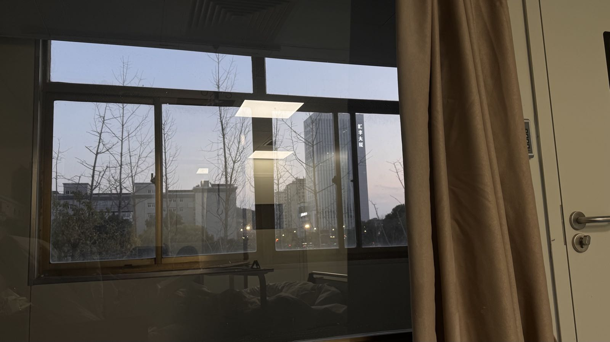
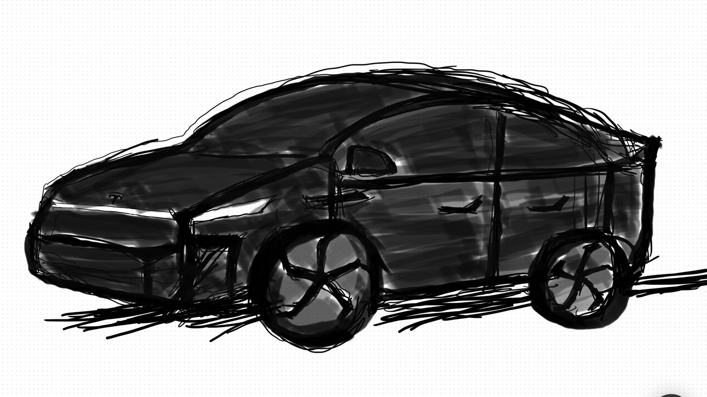
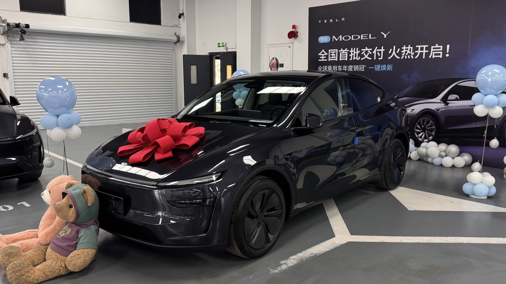
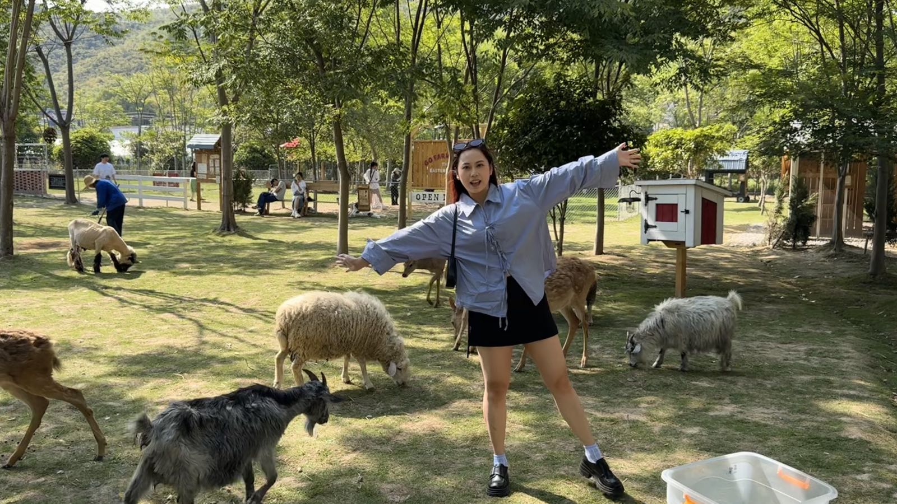
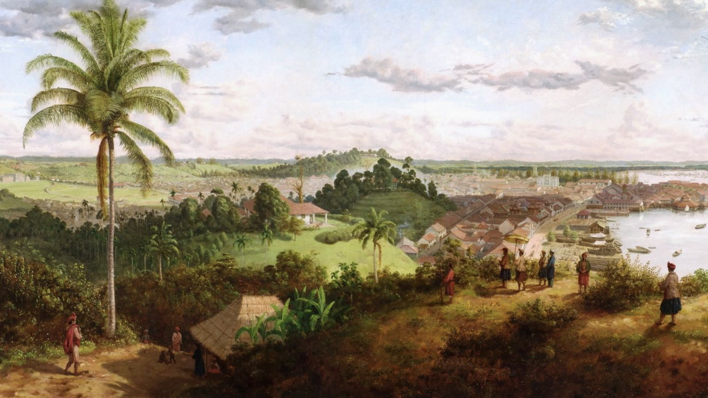

健康｜车｜钱｜家｜我

<!--more-->
---

## 健康

首先要说的就是自己的健康。每个人都有自己的追求，有的人可以放弃关系追求名利，有的人放弃名利追求自由，没有绝对的对错之分，但是一提到健康，所有人都会肃然起敬，想必每个人都经历过生病了才知道健康有多重要。

如果给24年底的健康打分是90分，25年我觉得是92分。

体重方面这一年胖了十斤，之前太瘦了像个细狗。但新的一年要注意控制饮食，避免一直胖下去。
翻开相册发现脸上的痘痘也比年初时好了很多，年初还养好了体检出来的小毛病。

不得不提的是中间三月份的时候突然发烧住院了一周，那段时间睡眠不好，工作上也比较不顺心，加上刚提车比较兴奋，记得周末早上六点左右醒了就睡不着了，可能抵抗力下降身体就遭不住发烧了，一烧起来两天都没有退，精神状态也差，一去医院抽血说指标很高建议住院，心想天塌了自己哪住过院，但是身体要紧，请了调休假、年假、病假，天天抽血把各种指标全查了一遍，排除了各种病，最后也没个结论到底是什么病因，只是等到各种指标恢复正常就自动出院了。

回想住院的那一周想是做梦一样很不真实。开始的前两天状态差，很乏力，但只要吃了退烧药过半个小时立马恢复正常，自己扶自己起来刷手机，学习。那段时间喜欢吃西贝的肉夹馍和小米粥（结果下半年被老罗因为预制菜的事情暴锤），追了杜克和一哥的全集（真的很有沉浸感，bgm一响就有种穿越到孟加拉的感觉，虽然故事的结尾配不上开头），还看了很多二狗的脱口秀视频（是那段时间为数不多的快乐）。老婆还会下班过来照顾我，意想不到的平时像个NPC一样一靠近就自动给我触发任务的她，关键时候像天使一样悉心，让我觉得亏欠她很多。但是药效一过状态立马变差，尤其是夜里差到睡不着，自己辗转反侧在病床上看着手表上的时间一分一秒的过去，头很晕，夜又长。有次实在撑不住了按了呼叫，让护士拿了退烧药，喝下去出了很多汗后才睡着。过两天其实状态好转了，但是抽血的指标没降到正常不让出院，有两天晚上自己在空荡的医院里散步，突然想喝大学时在小卖部常买的红枣酸奶，也不顾容易长痘了，带着口罩去便利店买，顺便给爷爷奶奶打电话说自己最近在正常上班，晚上饿了出来买个东西吃。一周的独处，很漫长，又很不真实。

每年的体检都像是学生时代的期末考试，体检报告就是批下来的答卷，今年我给自己打分92分。

## 车

上面说到三月初提车，是今年年初做的决定。去年年底看到ModelY时隔多年出了新款，新款前灯和尾灯我在第一眼就爱上，再加上过了这个村没这个店的首发权益（韭菜权益），直接交了订金，在实体店看都没看过实车，更别说试驾了。过节在老家刷到网上爆出来的各个角度的实车图，满是喜欢地在平板上临摹。

一边画着一边想有了车之后就能实现自己这多年积攒的愿望了。过去几年来一遇到一些有用车需求的事，就在心里想买车碎片➕1，例如可以去超市买完东西不用很麻烦地铁提一路，下雨天再也不怕淋雨，不怕风吹日晒，通勤时间可以节约出来，还可以和朋友在周边游，去露营，还能开顺风车和别人聊天…尤其多年前在上一家公司时候，当时电瓶车停在负一层，老婆来我这边吃饭，带着她下负一层穿过了一众的汽车，来到了一个小破电瓶车旁，因为电瓶车动力不强，从负一到一楼的上坡骑着费劲，带人的话更是骑不不上去，我们要一起在出口上坡走上去，因为是个商场，这个过程中进进出出的汽车映衬着我俩的无力。骑的路上老婆说她很喜欢坐我的电瓶车兜风，我开玩笑说要珍惜现在没买车的时候，买了车就没机会坐电瓶车了。

我的新Y是全国首批交付的，因为没赶上杭州补贴，订单就转到苏州去蹭补贴，春节的时候一直在刷小红书，看全国各地网友有谁更新的交付进展，本来还在后悔下单晚了不然可以更早的提到，没想到很快的也接到通知说首周的周末就可以提了。那时候的新Y可以说在路上比较罕见，自己的一点虚荣心得到了满足。

不过提了车就要直面新手开车的问题了，我自从几年前考完驾照之后就再也没开过车，而且考驾照也完全是应试。自己可以说是零开车经验，决定先去店里试驾一下，毕竟早晚都要迈出这一步，干就完了。

可能我是先天开车圣体。试驾起来不仅没有网上说的新Y刹车硬的问题（应该是我没碰过别的车，没有对比），而且开起来也比想象中简单。之后更是一路像开挂一样进步飞快，提车第一天就开了杭州城区的夜路，第二天就上了高架，一个月后就上了高速，带老婆绕着太湖去了湖州、无锡、苏州，最后回到杭州又去了青山湖。三个月就注册了顺风车，把哥哥平台的首单奖励薅了一遍。截至年底，这九个月已经开了一万五千公里。借此机会也推荐一下 [十二学车](https://www.douyin.com/search/%E5%8D%81%E4%BA%8C%E5%AD%A6%E8%BD%A6) 这个博主的各种场景倒车入库的教学，不是死板的教各种点位，而是讲思路，里面的平移大法我一直都在用。

这大半年来车子陪着我上班，装修，朋友婚礼，周边旅游，去火车站接爸妈，接朋友，看完F1之后的心血澎湃的体验零百加速。

开车总能让我有种心流的感觉。心里有想去的地方，只要坐着脚，放在油门上，手握住方向盘，就能掌控自己前进的方向，到达自己想去的地方。

## 钱

24年底以及25年初买了一点比特币，以太坊，纯碰运气的赚了点零花钱，之后比特币跌到9w左右的时候就收手了。

另外就是听朋友得知我们还有满足条件的杭州补贴可以领，想不到申请政府的补贴也能作为收入的一部分，这简直就像捡钱。

想想今年自己对于钱的理解还是没有进步。26年打算装修完后投资起来股票，A股港股美股（毕竟有个财务兼会计的老婆）。另外还有加密货币。

## 工作

#Todo

## 家

年初陪老婆做了激光手术摘掉眼镜，老婆也继去年拿下CPA后，今年又相继拿下中级会计师和税务师，年末还学了街舞和普拉提。

今年在家庭层面高光时刻，就是国庆时和老婆带着爸妈重返新加坡，见[国庆全家新加坡之行]()。

小猫在年底圣诞也两周岁了，这一整年都一直待在家里，没带他出去玩过，有点亏欠小猫，不过快搬新家了，设备阳台已经给它安排了阳光房，可以从门板上开的猫洞进入，岛台下面还给他留了空间放饮水机和喂食机，希望小猫入住后喜欢。

持续今年大半年的装修先Todo吧，后面补上。

## 我

想到今年很火的"从夯到垃"，就个人成长来说，必须给到夯的就是重启了个人博客网站，而且申请到了 [terryhu.cn](https://terryhu.cn) 的独立域名，目前以每周一篇的频率持续更新中。

另一个可以给到夯的是今年又培养了一个新的爱好，听播客。之前散步、开车时总是在听歌，但时间久了总感觉听歌的信息密度太少了，只能提供情绪，吃饭、散步和开车等闲散时间算起来其实并不少（这也是后面听播客时候意识到的，例如一期节目还剩下半个小时，看似很长，但是散个步到吃饭吃一半的功夫就听完了，听播客并不需要像看电影一样，人不能边开车边看电影，但是可以边开车边听播客。

尤其爱听的是和各个领域的大牛长达几个小时访谈的，推荐下面几个： [罗永浩的十字路口](https://space.bilibili.com/538596213?spm_id_from=333.788.upinfo.head.click)，[Joe Rogan](https://www.youtube.com/@joerogan)，[张小珺商业访谈录](https://www.youtube.com/@benitazxj)，[电动Emma与大小马聊科技](https://space.bilibili.com/387590474)，[闪光少女斯斯](https://space.bilibili.com/10613186)。

这种长达几个小时的访谈并不会让我感觉枯燥，可能大家都有过这种感觉，某个博主同一个抖音短视频里的样子和他直播的样子完全不一样，看多了“精装的朋友圈”，吸引我的更是一个人最自然的样子，人与人最大的不同可能就隐藏在更自然的对话中。

看这些在领域里top1级的大牛都能把一项技术说的通俗易懂，聊起天来反而不会让你感觉他每句话都像听天书一样晦涩难懂，而更多的是言之凿凿，拨云见日，一针见血的“人话”，而且适时的还会开些玩笑，让我明白“幽默是溢出的智慧”。之后生活中每每遇到有人不说人话——满口全是专业名词，行业黑话，之乎者也之时，都有可能实际上几斤几两可能自己掂量不清，而或就是想忽悠你。

