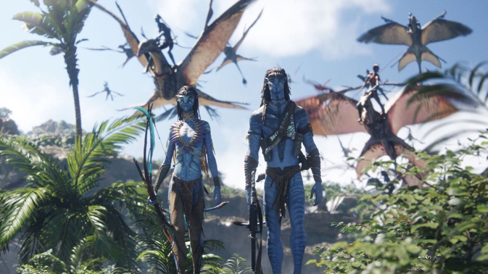

大鹏｜阿凡达｜职业选择｜洗牙

<!--more-->
---

## 🎧 罗永浩✖️大鹏

周一的时候十字路口群里小助理放出提示，说这一期的嘉宾是主持人、演员、导演、编剧，AI猜是黄渤/徐峥/何炅。这里随便选一个都很期待，可谓调足了胃口。没想到下午十字路口就直接名牌这期是大鹏，超出预料但期待程度丝毫不减，甚至更多。

高中时候看屌丝男士时候认识的大鹏，之后大学每每坐火车往返大学，好几次出发前都在平板里在搜狐视频APP缓存了屌丝男士，还有夏洛特烦恼，还有很多想不起来的电影、B站视频。这里面屌丝男士和夏洛特烦恼看过不下三遍，陪着走过很多遍东北往返徐州的路。

## 🔥 阿凡达: 火与烬

冲的万象城的IMAX厅。很神奇，每次去万象城看电影都能碰到老外，这次也没例外。

可能是INFP的缘故，好喜欢阿凡达电影里对于潘多拉星球上细节，尤其是对于礁人族水上生活的特写。

## 🛤️ 面临选择：积攒项目经验而苟活，还是把握机会领大礼包？

到年底了，按半年前和领导谈话后的说法，马上要面临一次选择，接着当牛马还是把握机会领个大礼包离职？

这半年其实已经相当于换了个公司工作，但合同还在前公司。这小半年其实工作强度比之前大很多，因为没有了园区，福利也差一些，唯一好的就是新项目用的技术栈很前沿，Argo工作流，Postgresql, k8s, iceberg, starrocks, flink, kafka, s3, prometheus, grafana...但动不动搞到10点，日常都要9点下班，好在现在还有双休，如果月底签了合同双休都保不住了。

周三睡前想到这次很可能是一次宝贵的机会，毕业后已经连轴转了四五年，回头望这四五年其实过的很快，相信很多人都有这种感受，当了牛马之后时间像按了加速键的流逝，更可悲的是一上班很多时间都在盼着时间赶快流逝到周末，人生变得只有七分之二，很多重要的事甚至都要请假去做，像是只有在工作之余才能享受到碎片化的生活。能领大礼包不容易，很多人想领都领不到。如果不珍惜这次机会，很有可能再一眨眼又过了两年，就到了30岁。

一想到现在面临的不仅是一次选择，更是人生中一次重要的岔路口，而且在岔路口的另一边还能看到明媚的光，我竟激动的没睡着，辗转反侧到了一点多。之后强行控制呼吸，一点点自我催眠才睡着。

## 🦷 体验洗牙

周日时候送老婆拍写真，下午空闲之余约了个洗牙。还从没洗过牙想体验下，另外之前就了解到中国人对口腔健康不够重视，洗洗牙总是好的。

