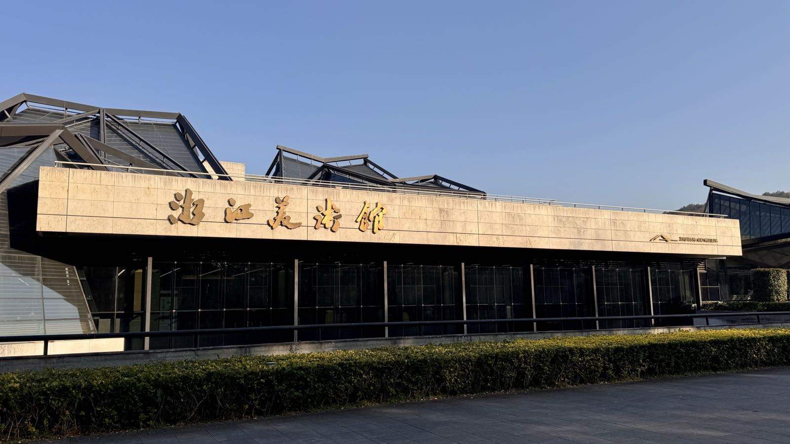
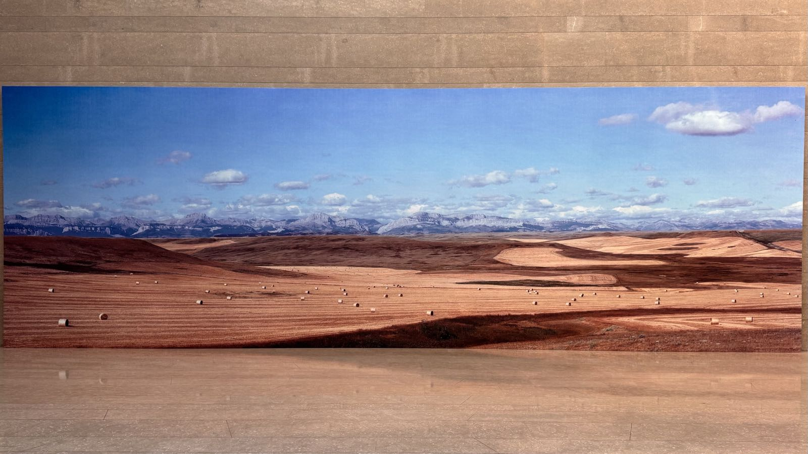
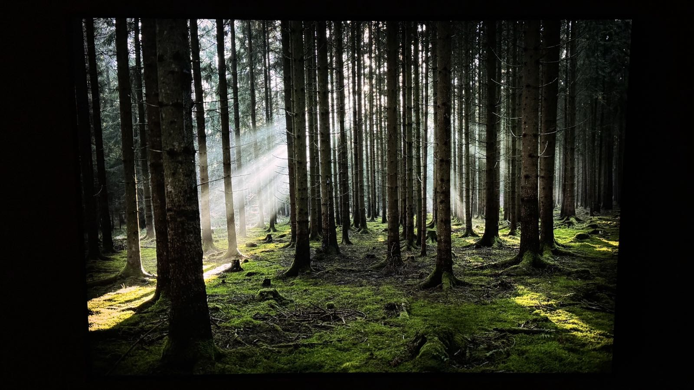
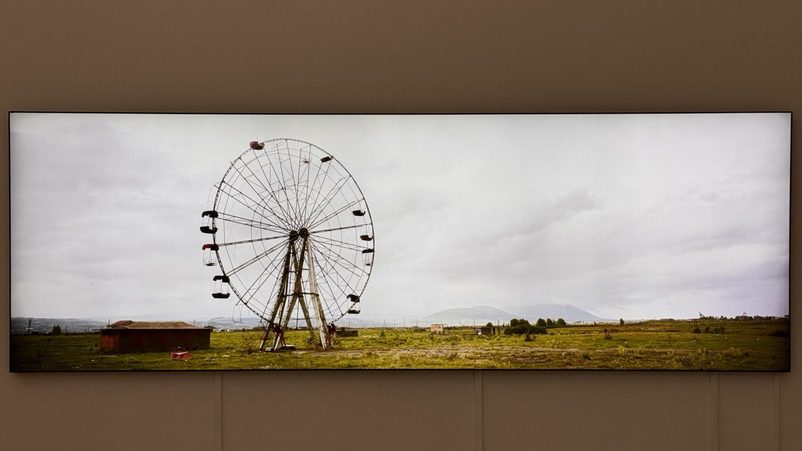
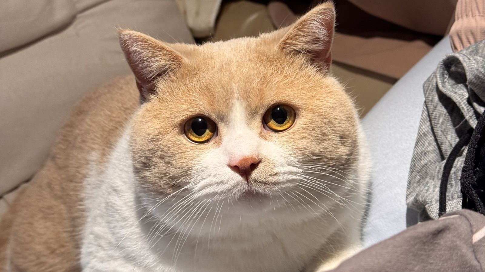
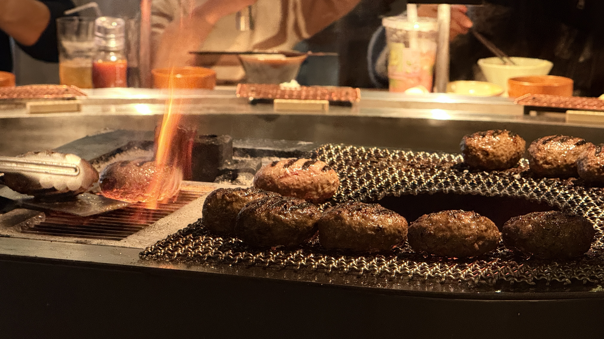

体检｜美术馆｜小猫两岁｜挽肉と米

<!--more-->
---

## 🩻 体检

又到了一年一度体检的时候，像期末考试一样，要交出这一年身体的答卷。

这次先是就近约的爱康，但听同事说这种机构很水就改到城东医院。结果没想到城东医院更是有点穷乡僻壤的感觉，在那里体检的鲜有年轻人的身影，早餐就是一次性塑料碗装的粥、烧卖，配上榨菜和一个鸡蛋，过程中还夹带私货有中医环节，结果一进去给我把脉就说我这个体质是个需要花900多的体质，说我不爱运动？气虚？我怀疑如果上来不先看我个人信息，直接把他眼睛蒙着给我把脉，会说的更扯。

好在结果是好的。没有什么异常，就是胆红素还是有点高，新的一年愿自己身体继续健康。

## 🎨 Wim Wenders & Robert Bosisio双人展

最早在小红书上刷到的，说是INFP一定会喜欢的展。

进去才了解到是两位艺术家的双人展，有摄影作品也有绘画作品，而这两种艺术形式在展览中并没有在隔开在不同展厅，而是有间隔地排列布局在一起展示。逛了一圈发现相对于肖像的绘画，自己更喜欢展中的摄影作品，尤其是既展示辽阔风景，同时又带有线条等构图的作品，这正是Wim Wenders的作品。

篇幅有限，上面那张以及下面两张，是这次展览中个人喜爱之最。

出了美术馆，我突然开始思考为什么人类社会需要艺术？

## 🎂 小猫两周岁

皮蛋又健康地度过了一年，12月25号晚上没有加班很晚就提前回家给皮蛋过生日了。

明年搬家带皮蛋过更好的日子。

## 🍽 挽肉と米

吃过很多次肉肉大米，但一直想去日本吃正版这家「挽肉と米」。就在前些天喜闻乐见的知道加盟到了杭州嘉里中心。

不过单人129的最低消费属实比肉肉大米贵上了一倍多。整体下来无论环境、餐具确实比肉肉大米更加精致，服务也更加到位。但是于我而言是95分与90分之间的区别。得，重在体检，下次再选我还是会选肉肉大米。

