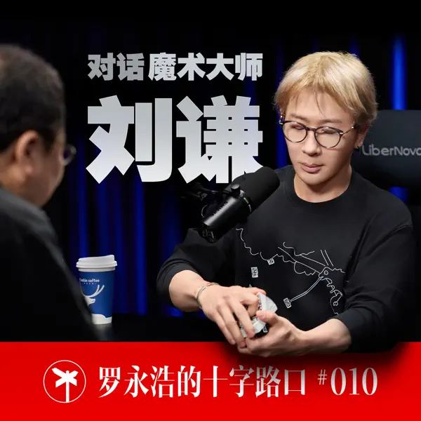
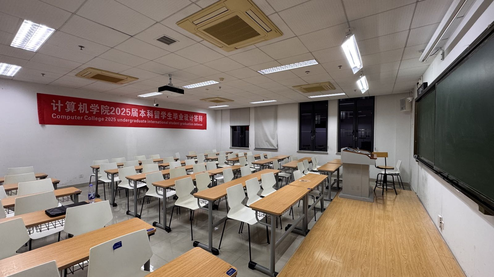
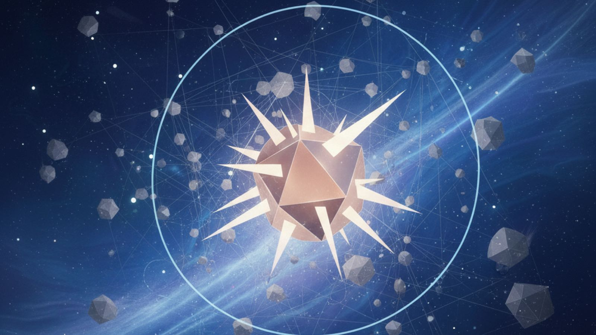

牛马又一周｜刘谦｜多面体于无限画布

<!--more-->
---

## 🐂 又是一周被push疯狂加班赶项目

新项目着急做出一个完整的demo，定的日期是这周完成全链路串起来，月底要能实现生产级别的功能。
上周五的时候开会时领导讲了目前架构的设计，抽象层面大家是对齐了。但是这周到了具体实现层面，发现并没有想的那么顺利。

尤其是我这一环，算是整个链路的第一环，需要处理文件进行解析，并将解析出的信息入到数据库，下游其他环节理论上就无需对文件再进行解析，而是需要什么都从数据库中读取。所以算是整个链路中任务最重的环节，而这又偏偏是第一环，下游没有我的输出就没法串起来。过程中我这边一边开发，领导那边还有新的想法，这些“需求变更”对我来说更是雪上加霜。

每天的状态就是在不确定地去上班，工位一坐就是一天，晚上加班到十点多精疲力尽地下班。

好在领导不是那种喜欢PUA的人，很能聊得来，不然这个工作强度再外加有毒的氛围，没人能顶得住。虽然身体上已经感觉到了异样。周三时候感觉眼睛疼，一开始还以为是屏幕看多了，后来又发现有口腔溃疡才意识到是上火了，甚至周四晚上一觉醒来喉咙疼了，周五晚上甚至开始流鼻涕有感冒的前兆。又好在周五晚上好好睡了一觉，周六就感觉好多了。

## 🎧 罗永浩✖️刘谦

前段时间加了十字路口的小助理群，公布嘉宾的前几天小助理在群里不断放出一些提示词预热，先是上过春晚，而后是这次播客中途有表演，看到群里猜的一众名人当中就有猜刘谦的，当时想想如果真是刘谦那节目效果爆炸。

这期播客也是在上下班以及散步吃饭的空余时间，听完看完。整个节目听下来印象非常深刻的就是刘谦对于魔术这个艺术形式在别人面前呈现方式的理解。他提到魔术的本质就是骗，但是你不能让别人感觉到被骗，不要让别人和你产生对立的情绪，或是说让他感受到被挑战认知。好的魔术是自然而然发生的，要让观众有“这完全不可能发生”的感觉，而不是“他是用什么手法和机关做到的”。

节目开头还有一个很有意思的点，是刘谦初期会包装自己，买Gucci的西装，在互联网还没有很流行的情况下学着做自己的网站，并且让别人email自己的时候会假装有个六人团队，层层抄送之后自己再带两个助理出面，(活生生的Better call saul)，实际上都是自导自演以及找朋友撑的场面，但是他真的做到了fake it until you make it.

节目最后还有一个很有意思的点，他提到他家人都不喜欢看他魔术，他老婆不喜欢听他说教，儿子也不崇拜他老爸的魔术，只是一味的负责揭穿，全家人都对他祛魅了，只有当他出席节目或者巡演的时候，他们用第三人称视角看才会感觉他说的话确实有道理，在魔术届的影响力也确实强。

节目中提到的魔壶（想要什么饮料都能倒出来），巴格拉斯效应（在不碰扑克牌的情况下，找两个观众，一个说花色，一个说数字，最后翻到那个数字对应的扑克就是那个花色），以及他最崇拜的组合Penn & Teller，过程中也都在b站里看完了视频，真的很有意思。

## 💭 人生意义抽象模型———多面体于无限画布

这周老婆考试在浙江科技大学，上次陪她来过隔壁的浙江工业大学，时间也正是自己网站第一篇文章发布之时，记得当时找了计算机学院的一间教室就一直在捣鼓网站，用的[hugo-theme-dream](https://github.com/g1eny0ung/hugo-theme-dream/tree/445aea8eaf61564106232bf2d3a293bc901b509a)这个模板，还发现了一个小问题，给作者发了邮件后面还加了微信交流。如今两个月过去了，自己也坚持下来每周一篇的更新。

浙科大不让校外车进，这回我又把车开进了隔壁浙工大，又和上次一样在计算机楼找了一间教室坐了下来，顺便又思考了一下人生的意义。

抱歉这个话题转的有些突兀且生硬。一下从一个无聊的流水账转到了人生的意义这个对于每个人来说都很重要的话题。是因为最近很长一段自己都在思考这个问题，而且不知道是不是年龄到了，对于一些词也是愈发敏感的能够捕捉的到，例如圈子，圈层，层次，层级，鄙视链，资本，三六九等，消费主义，利益，杠杆，廉价劳动力等等，很多上学时候很天真的以为很多事情只有表面上这么积极，实则背后都是藏着别人的制定的规则与算计。

想象一下每个人的价值（价值多少在于他能给别人带来多少的价值，因为这个社会最本质的运行逻辑就是价值的交换）都有多个维度，健康、时间、钱、关系、事业、认知等等，我姑且统称之为多面体。

人生的意义就是掌控住自己的多面体，并不断的扩张它，让自己拥有更多选择权，能在社会这张无限画布中自由的穿梭。
