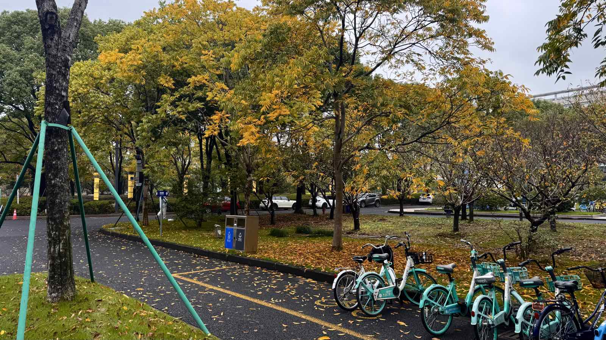

忙于工作｜软考结束

<!--more-->
---

## 工作上"任务多"和"氛围差"，哪个更累？

这周忙碌了整整一周，每天都是9点到工作往那一坐，一直工作到中午干饭，然后下午再往那一坐，又接着干到下午下班，然后吃个晚饭溜达一圈，接着再干到9点多，晚上回到家已是10点出头，洗个澡刷下手机电脑便是睡觉。如此反复，连轴转五天到周末才得以喘息。

忙的时候真是没空思考，思考每天的工作是不是碌碌无为，思考自己的工作到底有什么意义。之前在上家公司时还觉得下午4个小时太漫长了，目前在新公司几个月从没有过这种感觉，每天下午都是摸起鼠标键盘，时间就自动加速。脑子里想的只有今天的目标能不能完成。

这么忙的原因是在做新公司的新项目，领导定的目标是11月底必须做出来，在此之上还有每周的目标，而我恰好要做的是第一个环节，压力就这么给到我了，而我也想借此机会证明下自己有能力完成。

还有一个原因是新的工作环境氛围比之前好了太多，实际上心里并没有这么累，比起之前Toxic的环境，周遭充斥了吵架声、抱怨声、嘲讽声。经历过后更加印证了工作氛围的好坏与领导的性格是强相关的。目前的领导鼓励交流，推崇新技术、新工具。我喜欢目前的工作环境。而且新的项目架构用的技术栈也很新，每次开会都有一种和一群对的人做正确的事的劲头，唯一不好的就是时间赶的太紧了，这或许又是领导、以及领导的领导的老套路了，但无奈我在最后执行者的一层，不push我快点做怎么层层上报进度。

## 又一次考完了没怎么准备的软考

准考证打印出来才看到，这次的软考还是浙江财经大学，甚至还是上次那栋楼，而且我还是没准备好。但和上次五月份相比，不一样的是这次的季节已是深秋。

这次选择题以为过了一遍b站上的真题解析稳了，结果上午考试时一开始就连续标记了十几题不确定的，以至于我都看了看考的试是不是系统架构设计师，各种稀奇古怪的题目。

案例题也是同样的离谱，甚至再给我两周时间准备，我觉得也准备不好。下午的论文之前都想放弃的，毕竟没准备好去那坐着两个小时也无聊，但考前一晚决定博一博，把目前做的新项目理了一遍，喂给AI历年的论文题目、模板和范文，让他帮我生成一个可以套进任何考题的无敌论文。

上午考完选择和案例题，中午简单吃了吃便在车里背我的无敌论文，中间又改了改，两点时觉都没来及睡就去了考场。那一刻对我来说不存在押题，我不语，只是一味的默写着我事先准备额的论文，没想到两个小时的考试我竟然从头写到尾。和最近上班的状态很像。而且好消息是这次字数够了，符不符合考题不说，至少不会和上次一样因为字数扣分了。还有个好处就是自己对当前项目的理解也深了一层。

