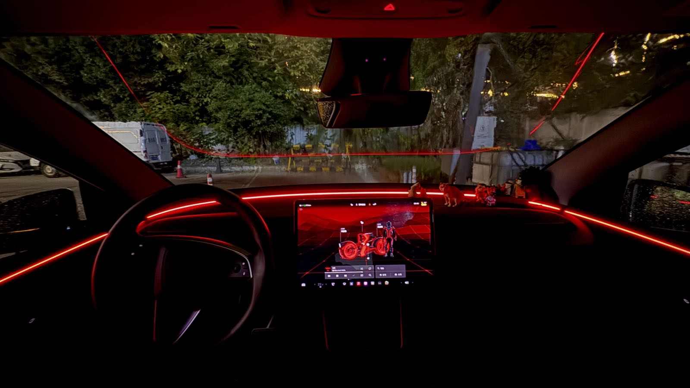
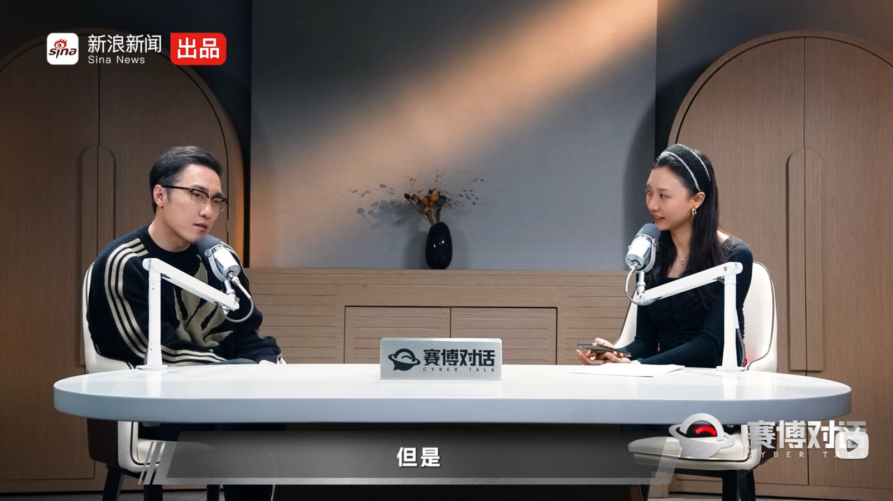
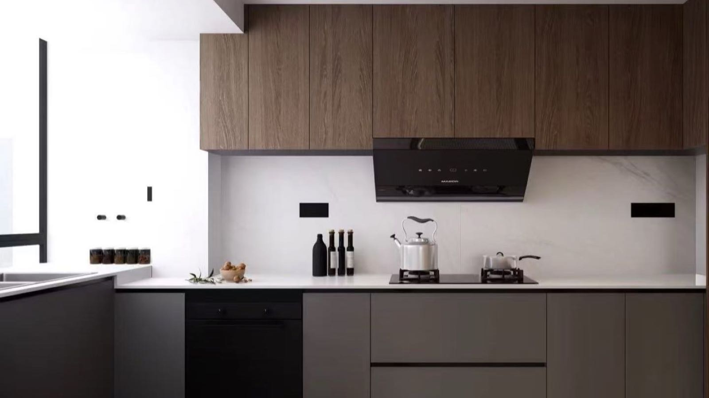

王自如×Emma｜厨房装修讨价还价

<!--more-->
---

封面为近期特斯拉更新的2025.38.11版本里的TRON模式

## 🎧 王自如✖️电动Emma

最近又关注了一个宝藏博主电动Emma，这一期她的《赛博对话》节目里请到了王自如。

之前对王自如的印象就停留在之前快被罗永浩怼哭的时候，"被包养就不要谈独立人格"，以及到后来的一句"我没看过格力的工资条"，再到最近发了个因为被限制高消费只能做绿皮火车吃泡面的视频，并且决定在AI赛道创业。这么一套下来整体给人的感觉就像个小丑，一个在科技圈想要立足却屡战屡败的loser...

但是听完这次节目下来发现完全改观。

首先无可否认的是他的身份远超一般人，他可是之前ZEALER的CEO（专注于数码产品测评，早期获得了雷军的顺为资本的投资），和雷军、董明珠这种大佬都有交集，而且他在格力是负责数字化转型的高管。能站到他那个位置的人必然有他过人之处，就像很多NBA球迷喜欢激情对喷xxx打的菜，实际上如果稍加反思，自己根本没有那资格评价，某种程度上都算是"僭越"了。

其次是他的认知。他说很多人对于成功人士之所以能够成功的理解，都是很单一片面的，而实际上影响成功的因素有很多。但很多人都只相信某某成功是因为他的某一个特质，而忽略了其他因素的相互作用。这种一元化、标签化的认知就是一种低层次的认知。原文在（此链接已定位到12分54秒处王自如谈优秀企业家的共同特质）

突然想到他谈及雷军、董明珠、黄仁勋时，听到我不止一次听到的对于他们的评价，都是近乎偏执狂的努力，在经过深思熟虑过后的道路上保持超高的迭代频率。谈到有次和雷军谈合作，聊到后半夜之后雷军说等下还有一个会要谈。

而且将他所见所闻直接分享出来，没有那种藏着掖着的虚伪。例如他提到会把手机改成英文，很多APP都少了广告；他自己在用gpt5, gemini, xcode, cursor，国内的做的也挺不错，但更适合国人（比如老一辈父母），算力方面就是比国外差；日用品比如海飞丝和力士洗发水的差价在营销上，而不在成分上...

过程中想到一个有意思的点，当问到王自如有没有可能上罗永浩的播客节目，他回答说网友对于罗永浩的同台的期望比他们两人自己都要高，而且罗永浩不需要他，所以没有这个打算。想了想王自如虽然不那么虚伪，但是总感觉不像罗永浩以及目前所有嘉宾来说谈吐之间显得那么真诚...

## 🔪 厨房装修讨价还价

家里厨房和其他部分的柜子是分开定制的，过程可谓是一波三折，像游戏中一段支线一样有段故事。

半年前找全屋定制时也对比了很多家，最终选了一家朋友家做过的，但是也并不觉得非常满意，主要是设计非常普通，甚至可以说是毫无特点，只是有朋友母亲家选择的他家，完全是借着朋友家的背书选择了他家。因为当时也并没有其他选择，就草率的交了意向金，然而交完没多久就看了更多的选择，从对老板的印象、设计、价格全方面都更好。

意向金的钱都已经到了人家钱包，问那肯定就是不能退了，顶多只能在店里买家具用。又因为算是朋友推荐的，不想投诉退款闹的不愉快，而且也是自己理亏。而且之后和新的全屋定制谈的也挺好，也签了合同。之前那笔意向金也就一直放在他们钱包半年，打算之后做个厨房再用掉。

装修真是个大工程，半年很快过去，现在到了该考虑厨房怎么定的时候了。问了交了意向金的那家刚好有想要的银拉丝，用意向金差不多能做下来，但是量完尺一给我们报价直接高了25%，一顿交涉也只能谈到再加20%，甚至再尝试沟通电话不接、好友不加、微信不回，演都不演了。没办法，还是那句话，钱都在人家手上。

后来给我整烦了，直接群里艾特他表示各退一步，就外加10%，外加20%我们接受不了，也聊了大半年了，期间也单程一小时路程过去很多次，这个价格还不接受我们就准备用各种方式退意向金了。另外消息不回，好友不加，电话不接不是一个应有的态度。 这几句话发完没多久他就回了说工作微信不常看，他找领导申请下。之后又拉扯到15%。

这个周末我能感觉到10%有戏，网上聊半天也不如现场面谈，索性直接再干过去，甚至他又想找借口说要出门量尺，然后晚上家里有事又要早回。最终还是给他逮到了，谈到愿意让我们先付15%，然后装完我们会各发小红书帖子，5%再返给我们，也就是变相给了个台阶下到10%。
