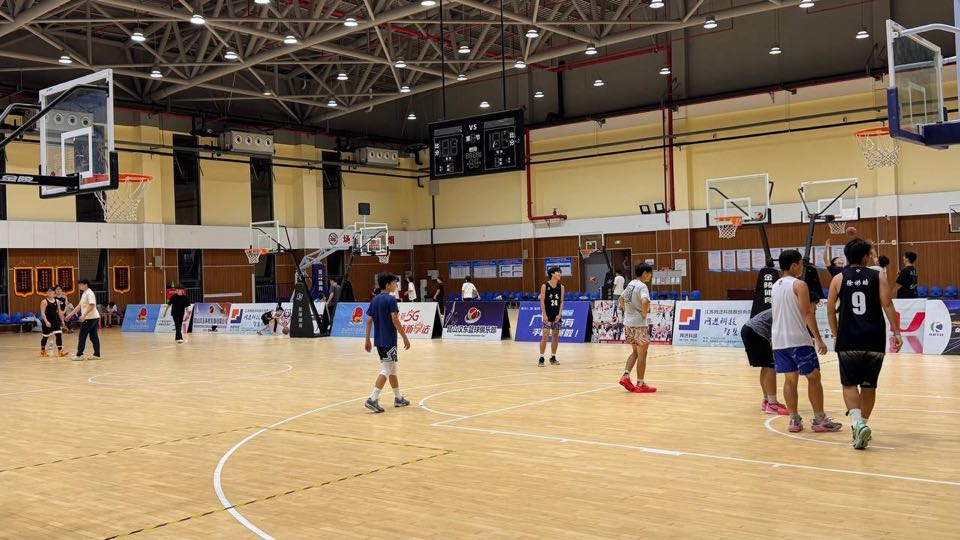
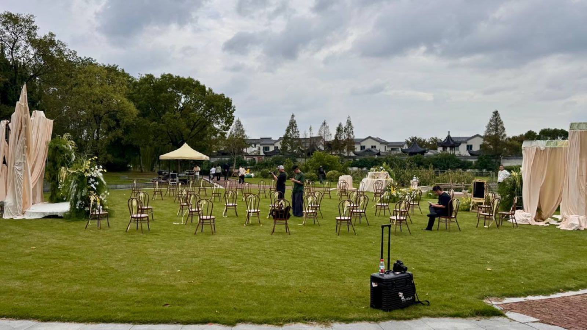

戒断入秋 ｜ 朋友结婚

<!--more-->
---

## 🍂 戒断入秋
像上天在游戏里输入了一条改变天气的作弊码，今年的夏天在一夜之间突然结束了。

感觉昨天穿着短袖短裤，最高温三十多度热的不行，如果长时间在外面走，晒得出汗到会出白色汗渍。然而一夜之间气温骤降，最高温一度降到20度以下，前一天晚上感觉准备御寒的外套我还在想会不会厚了，但第二天冷风夹杂着小雨只让我觉得穿多厚的外套都不为过。

这种突兀的变化，甚至会让我有戒断反应。像一场热闹聚会突然结束。没了冰镇西瓜，没了雪糕刺客，车里不用开空调了更不用座椅通风了，而且不能看腿了。夏天真的结束了。再见便是明年夏天。 

## 🤵🏻 朋友结婚

应该是岁数到了，好多朋友都结婚了，尤其在今年2025年。

我自己算是错峰结婚兼英年早婚，早在三年前就拿了证两年前结的婚。但是看着今年朋友圈里陆续看到越来越多的朋友领证结婚，也是最近才感觉到青春真的结束了，我们的人生又过了一个阶段。自己工作都快五年了，闲聊间不经意的就变成了叙旧。

更有割裂感的是朋友婚礼前一天晚上，和他上大学的弟弟去打球，球场上都是初高中生，现在的小孩打球感觉比我们之前好看多了，动作一套一套的，都是看抖音学的。

晚上打球完喝着佳得乐坐着他的小电驴回去时，真像是短暂的穿越了一下时空，回到了自己大学的时候。

朋友挑的日子实属良辰吉日，昨天过来的高速上雨大到再大一点就没法开了，然而仪式天公作美，即刻放晴，属实妙哉。朋友下午是先邀请至亲及年轻朋友参加草坪婚礼，晚上再请亲戚朋友一起吃席。

回去时候已是晚上8点，回杭州两个半小时的车程，这时又开始飘起了小雨，刚上高速发现两侧摄像头有些模糊，于是开了二三十公里就在第一个服务区下车擦了擦镜头。一下车居然体会到了久违的寒风，我擦了擦四周摄像头的同时绕着车子转了一圈已经有一种再多待一会可能感冒的感觉，已经记不得上一回有这种感觉是在几月。想起了平凡的世界开篇第一句话，细朦朦的雨丝夹杂着一星半点的雪花，正纷纷扬扬的飘散在这大地上，时令已过惊蛰...

回到车上，看着车上的朋友，还是车里暖和。

