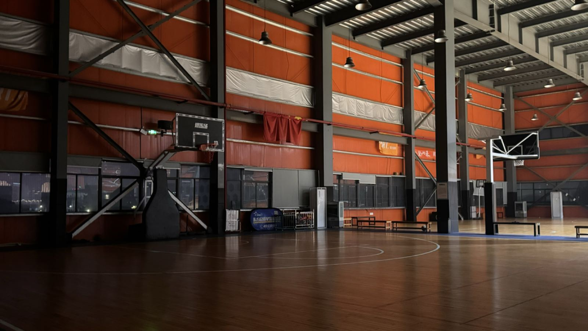
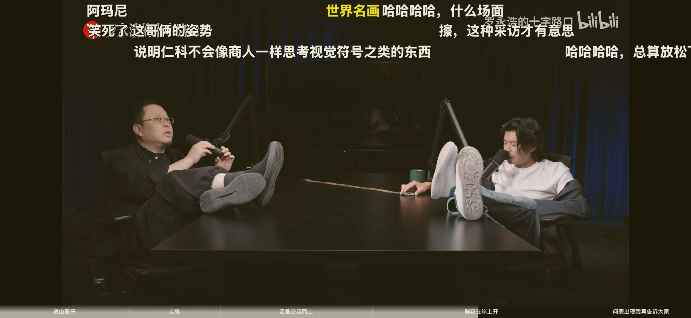

离职谢幕战 | 罗永浩仁科

<!--more-->
---

## 🔚 谢幕战

2023年9月到2025年9月，整整两年，随着比赛戏剧性的以加时队友三分绝杀结束，又一年我们夺冠，和原公司也算是好聚好散了。

今年部门赛开始的几场我还在这上班，没想到周五晚上的决赛我是打车过来的。因为中间缺了两周（部门周五包场，每周五常去的就固定那一波人，都很熟，如果说偶尔一周有谁有事没来很正常，连着半个月没见的话，闲聊时都会问上一句），外加和有几个工作上有交集的同事知道了我工作上变动的事，我一进球场和几个人打招呼，有同事问我过来多久，我说周五下班过来好堵，要大半个小时，有同事问我那边加班是不是好多，我说也差不多...他们应该都知道了我现在是个"外人"。

## 🎧 认识仁科

在听这期罗永浩的十字路口播客之前，我是完全不认识仁科的，虽然听过“五条人“这个乐队，但连这个乐队有几个人我都不知道，但《阿珍爱上了阿强》这歌倒是听过好几遍。

说实话，期待更新很久（一个星期）这期播客嘉宾是一个不认识的歌手这事，对我自己而言是失望的。前面访谈的李想，何小鹏，何广智，每期好几个小时，我是一期不落的听完，越听越上头，有一天我突然意识到上一次这么期待更新的节目还是speed来中国的时候。而且听播客这事是最近我在刻意练习的，我这人好像先天对声音不够敏感，就算独自在人少的地方戴着降噪耳机边听播客边散步，也会没走几步就会突然有一种“他们刚讲到哪了”，这知识不进脑子的感觉。对于刻意练习自己听播客的原因，有挺多的，最主要的应该就是每天有近一个小时的开车通勤的时间，刚开始的时候喜欢听歌，听the weeknd, 王嘉尔...我老婆喜欢听邓紫棋、单依纯、周杰伦...

但是听久了感觉歌曲还是有点乏味，像刷短视频一样刷完就忘了，于是乎想听点更有意义的，一开始作为律师粉我还导了Better Call Saul全集音频传到Apple Music云端，这样车里也能听，但是网络总时不时出问题就放弃了，那就只能听播客了。中间也听了很多节目，比如硬地骇客，忽左忽右，但都没老罗的十字路口听着最上头。尤其是最近公司入职了一个从其中一个车企跳槽过来的大哥，自己正好认真听过那期节目，和他晚上吃饭时多了很多话题好聊。

抱着前面几期都一期不落，这期就听试试的心态，我开始逐渐认识仁科。

作为语言爱好者，一开始我是被他的广东口音吸引，之后更吸引我的是他的思维—————

他提到年轻穷的时候喜欢在城市里漫无目的的瞎逛，去没建好的工地，看到外国人来旅游，自己和老外在同一时间共处同一个空间，不同的只是他们的心态，如果自己也能在待久了的地方切换成一个旅游心态，能发现很多平时没注意到的很有意思的点。

这时作为INFP，我已经扑捉到了仁科理想主义的那一面，查了下他果然是ENFP。 

而后一段对话更是印证了这一点————仁科说会想象自己可以穿越时间，想象自己是从五十多岁穿越过来的，也可以想象自己是从二十岁穿越过来的。这个思维刚开始描述两句话时候老罗还没get到时候我就get到了，因为我一直也用这个思维，我称之为存档和读档。因为时间永远在马不停蹄的流逝，什么都会过去，什么也都会到来。如果当下你在经历了不开心的事情，就想象自己可以穿越到这件事情结束的时候，等到事情真的结束的时候再想象自己那一刻是之前穿越过来的。如果在经历快乐的时候，就想象自己是未来哪一天自己期盼回到此时的，然后现在真的回到了。为了让这事更显得真实些，可以闭眼屏气凝神想象一会，效果更好。我是启发于小时候看爱情公寓，关谷和美嘉吵架时候存档，之后再读档一件愉快的时刻。同时也启发于《时空恋旅人》这部电影，男主有躲在衣柜里凭借想象就能穿越时空的能力。

