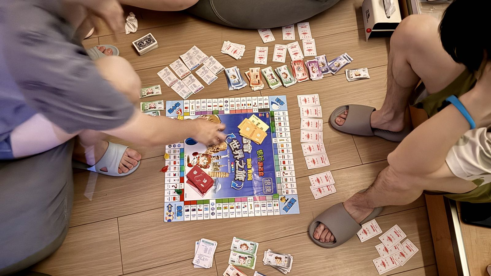
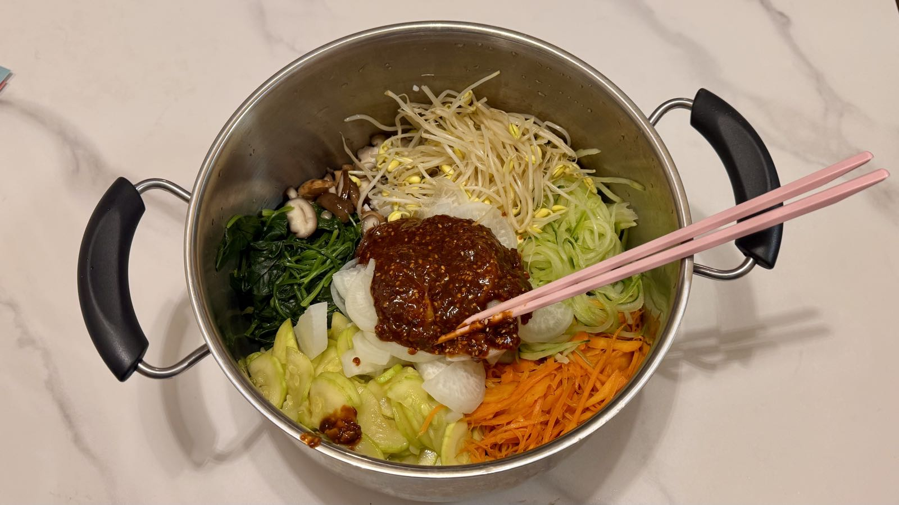

offer｜同学聚会｜下厨

<!--more-->
---

## 🚙 换了个赛道

HR赶在元旦前发了offer，给太多了，我选择加入（看人真准.gif）

在此郑重收回[之前考虑离职]()的想法。

## 🍺 元旦恰同学十年于杭州

从大一入学2016年，到今年的2026年，已经十年了。

一两个月大学室友群里，聊着聊着我们就决定元旦在杭州聚一聚。大家从大学毕业后就再也没见过了，甚至因为疫情我们连毕业典礼也没有，话说到这我整个学生生涯没参加过一次毕业典礼，因为之后的硕士在新加坡的时候正值疫情也没有。

来的两个室友分别从武汉和上海赶来，一起的还有一个大学在隔壁寝室，但是和我从大学到新加坡再到杭州工作都一直同行的兄弟。大家都别来无恙。

虽然节假日的温泉人很多，但是和有趣的人一起连抢位置和偷懒人沙发都很有趣，没一会我们就占领了一个`五人堆`，大家一起桑拿，泡澡，吃水果，玩桌游。

哥几个一会儿聊聊最近，一会儿回忆青春。想到一句话非常应景，朋友是彼此青春的收藏家。

## 🍳 韩式拌饭

老婆做的韩式拌饭和豆腐汤。

等过年后搬新家我们立志重操旧业，多下厨做饭烧菜，少下馆子。

