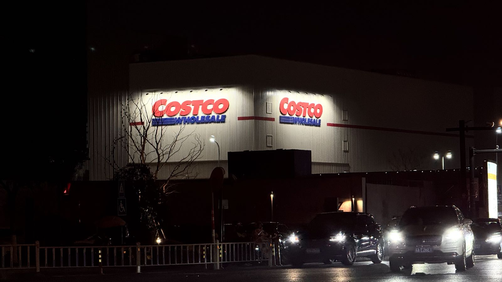
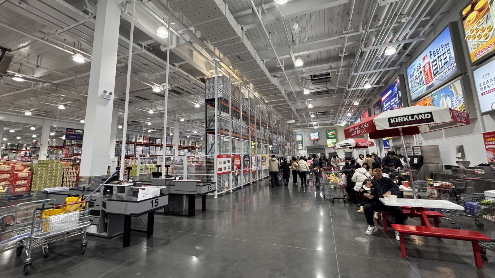

Costco开市客｜杠杆

<!--more-->
---

## 🛒 山姆会员到期，投奔开市客

一年的山姆会员在这周到期了，山姆客流量实在太大，停车体验极差，听说杭州开市客很好停车，遂即买了开市客，感受感受对雷军儿印象深刻的商业模式到底是怎么个事。

但感觉一趟逛下来，在选品上怎么感觉没山姆好...

## ⚖️ 有钱人和穷人的最大的区别，就是会不会用杠杆赚钱

最近在看《纳瓦尔宝典》，里面的这么一句话让我脑子一嗡：

>"Forget rich versus poor, white-collar versus blue. It's now leveraged >versus un-leveraged." 

> 忘了富人与穷人、白领与蓝领的区别吧。现在的区别是“利用了杠杆的人”和“没有利用杠杆的人”。

周日去朋友家做客，他是做生意的，说起他今年计划去东南亚做出海生意，中间问我了不了解AI。

他说抖音里还有朋友圈里总是刷到用AI可以生成视频，看到很多模型很厉害，还有工作流，输入模特的脸，以及竞品的视频，外加一些提示词，就能生成逼真的视频，还能有多个角度的版本。这套下来省时省力更省钱，对他的生意会大有帮助。

一直在网上刷到有关AI产品、出海的信息，之前在[程前朋友圈 - 2026年的机会在哪儿]()也提起过。但没想到这次“贴脸开大”般的发生在我面前，对于赚钱、出海以及AI都感兴趣的，聊的我想原地辞职加入他。但事实还是洗洗睡，明天继续996...