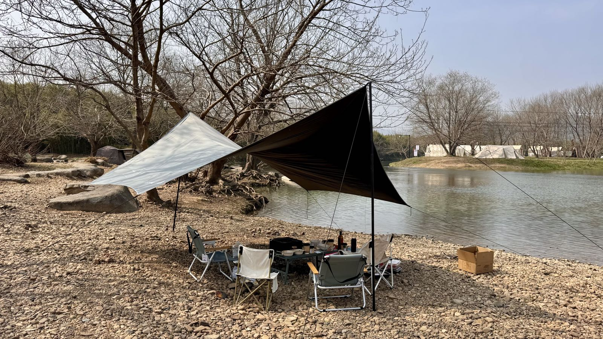
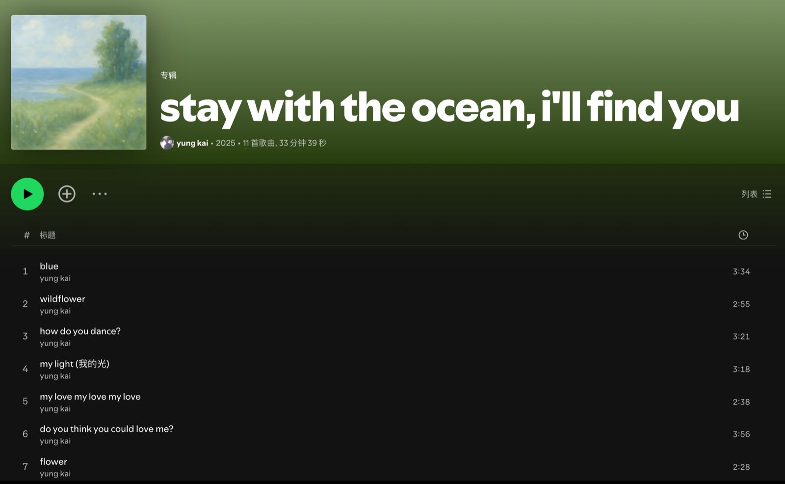
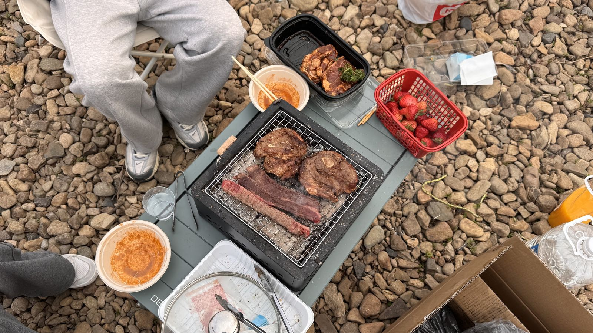
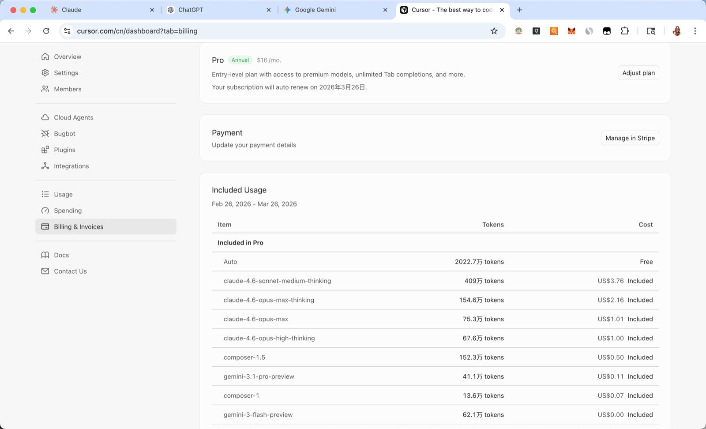
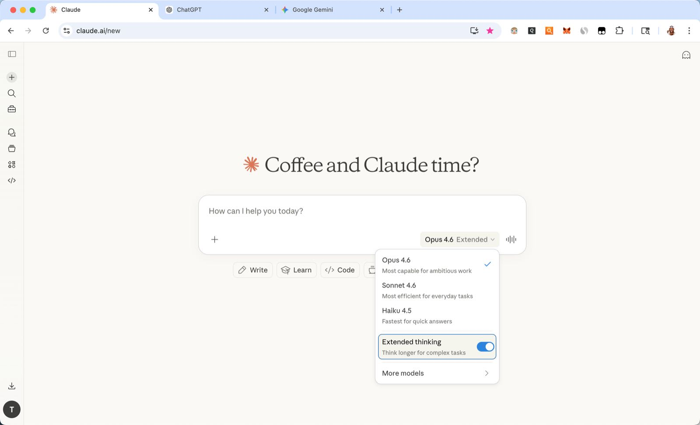
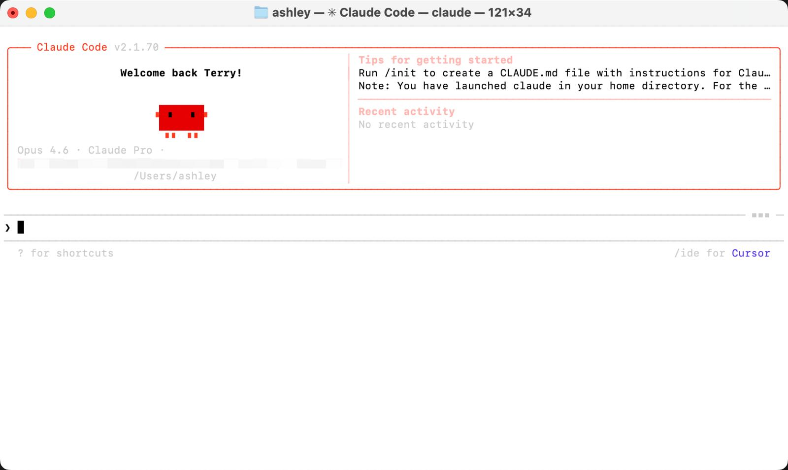
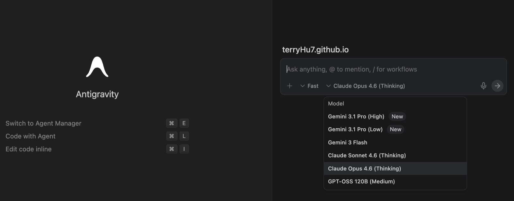
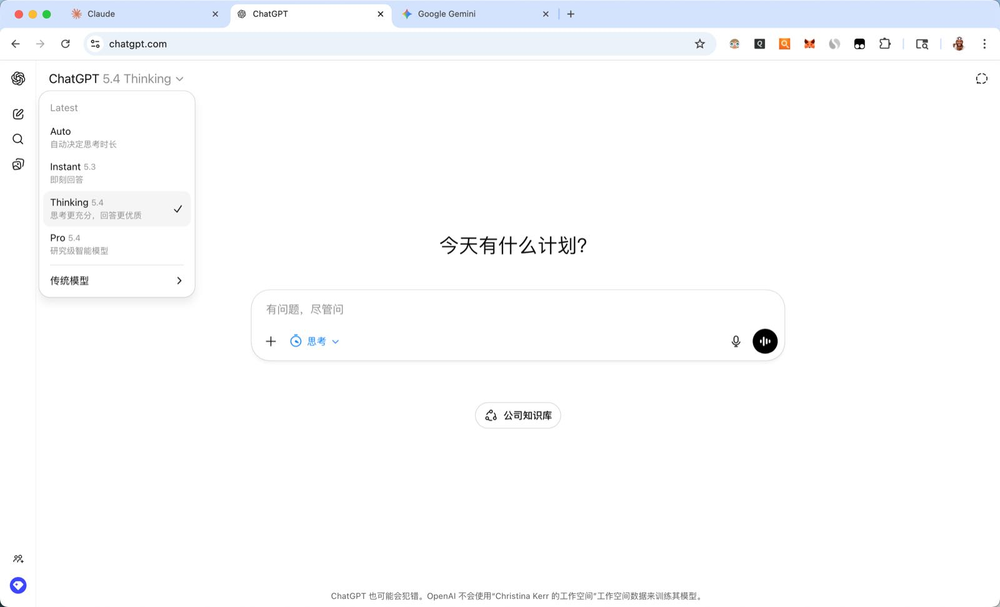
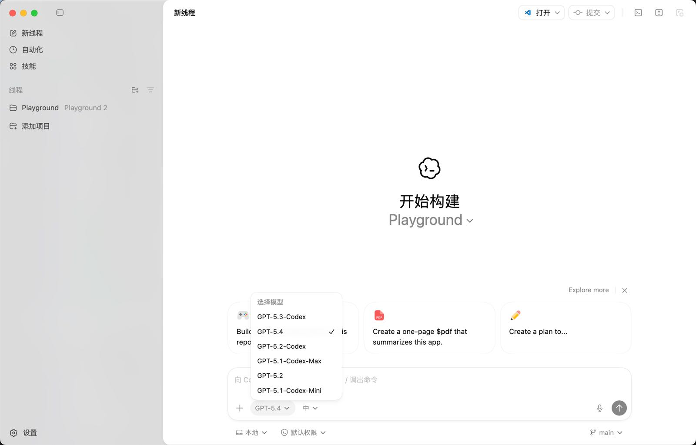

野炊｜AI｜AI Agent｜Vibe Coding

<!--more-->
---

## 🏕️ 余杭径山一日野炊

周末和朋友约了野炊，地点选在余杭的径山双溪绿道。

最近杭州天气不错，十几度不冷也不热，甚至有一天空气质量据说是排到了全球前十，能见度很高，站在楼上看真的不一样，像洗了许久没洗的车的挡风玻璃一样清澈。

都说人活几个瞬间，今天的瞬间是在这依山傍水的露营地听我坤哥的专辑KUN，以及yung kai的stay with the ocean, i'll find you.

看这一地的石头，边上就是条河，很难忍住不打水漂，上次打水漂还是上次。

野炊中还发现一个奇妙的共识，就是在很放松、很享受的同时，时间居然还会变慢，也不知道什么原因，搞得像这山脚下的能量场和闹市区不一样似的。我们几个人花了大把时间搭天幕，生炭烧烤，捡柴火煮火锅都以为过了好几个小时，却没想到一看手机才一小时。

难道是把时间花在自己身上就会有这种感觉。

## 🧠 集齐AI/AI Agent

这两周我把主流的AI/AI Agent全集齐了。

可能是AI圈里铺天盖地的消息，让我实在害怕失去，害怕落后，FOMO（fear of missing out）了。比如最新的ChatGPT 5.4震撼发布，往前推就是地表最~~贵~~强的Claude Opus 4.6，Gemini 3.1 Pro以及Nano Banana 2纷纷登场。外加时不时刷到“cursor相比claude code那已经是上个年代的工具了”这种暴论，属实让我招架不住。

对了说句题外话，现在AI圈自媒体鱼龙混杂，里面充斥着垃圾博主的垃圾内容，像潘多拉魔盒一样被释放了出来。这里安利一下[数字生命卡兹克](https://x.com/khazix0918?s=21)。

话说回来。既然打不过，那就加入，所有会员都加入。

上周再对比了几天的海外版的Trae和Cursor后，发现除了Trae里下掉了Claude模型外，其他方面好像没什么区别，同时看了网上的评论就感觉token消耗的很快，有种花钱还是要抠抠搜搜用的感觉。不过思来想去还是直接冲了cursor年付。

然而用了几天就后悔了。因为逐渐摸清了计费规则——25年的时候curosr就背刺了一波，从原先额度是按次计算，变成了按Token计算，之前pro是500次额度，一次对话不管烧了多少token都只算一次，但现在全是带thinking的推理模型，token消耗量大，尤其是claude opus 4.6，可以说在项目里问上两个问题1美刀就没了，完全就是烧钱机器，看到额度统计的百分比在10%，20%，30%这么直线上升时，终于直观的意识到，对我而言每月20刀的额度完全不够用。

其实之前也有想过对策，每月cursor额度用完了就一步到位用上claude的api，外加自己除了工作时写代码的需求以外，还想体验opus 4.6在日常对话里的表现，所以又开了claude pro，为了省点钱，在闲鱼里找到了6个月的claude pro兑换码。

自然也就解锁了claude code cli——

而gemini也是在闲鱼里加入的一年的家庭组，几十块一年，很便宜。Google更是像大善人一样直接提供了300刀的羊毛让你薅，甚至自家的IDE Antigravity里除了gemini，还可以选择claude opus 4.6。

同样的，在前几天ChatGPT 5.4一发布当天就闲鱼上加个Bussiness Team来尝鲜，codex IDE也相应解锁，同时听说GPT 5.4也是最适合openclaw小龙虾的天选模型。

这下再逛AI圈时看到什么"cc 5小时限制", "api中转站", "反代"之类的话题终于也有了自己的认识和理解，终于祛魅了。

但看着打开的这一大App和网页，像进入贤者模式一样突然感觉这不过也就是一场自嗨，而且接下来除了自嗨我并不知道该做什么。

vibe coding的真需求到底是什么？