春节｜徐州｜杭州｜舟山

<!--more-->
---

## 前言

什么都会过去，什么都会到来。

又是一年春节，马不停蹄，如约而至。

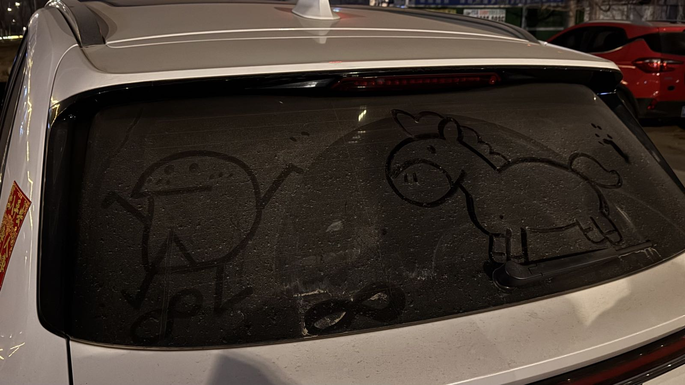

我的春节假期从2月13号晚上开始，到25号晚上结束，其中14号晚上坐高铁回到徐州老家过年，在老家待了一周，21号和爸妈一起开车回的杭州。

所以于我而言，我想把这篇博客划分成9号-14号、14号-21号、21号-25号三个部分，分别代表着我的年前、年中、年后。

## 年前

年前的工作氛围可以总结为——保障过年别出问题，如有需求年后再说。

都说人在无限接近幸福的时候最幸福，13、14号那两天算的上是我内心最平静的时候，是从工作到生活的过渡阶段，也是我从杭州生活回到徐州过年的过渡阶段，更是我的洞穴时刻，让我开始有时间去思考，思考过去，思考现在，思考将来。

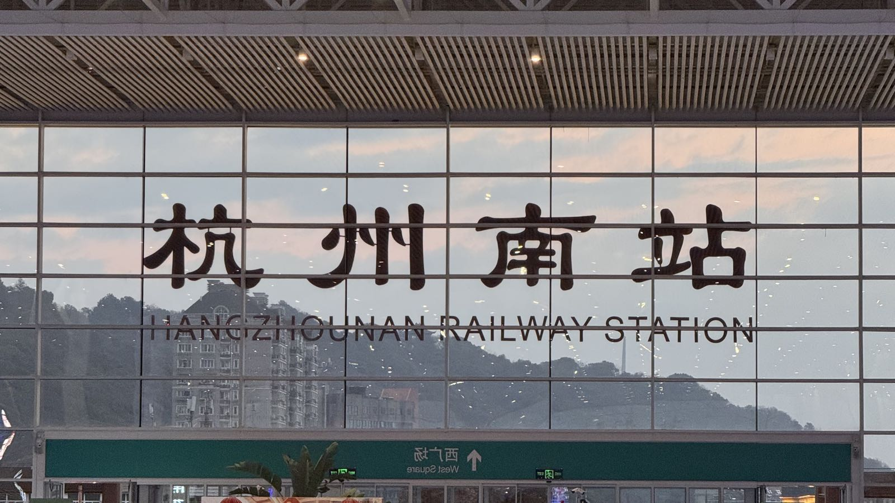

也就在这两天，还看了《纳瓦尔宝典》，和几集《纸牌屋》。

## 年中

今年的春节很长，往年都是一周，但今年能放十多天。但虽说有十多天，对我来说最有年味、真正意义上的假期就属在老家的那一周。

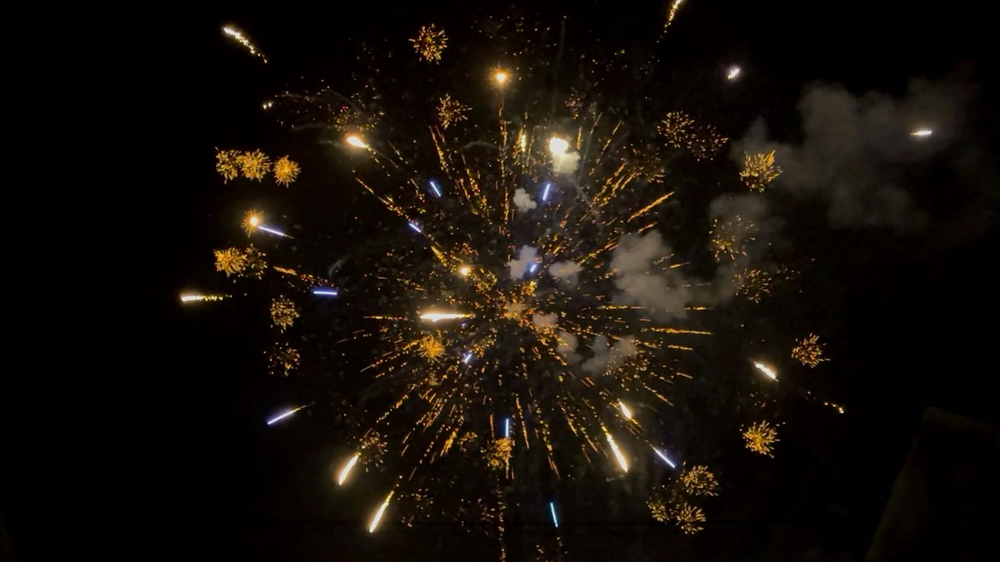

和往年一样，今年还是带老婆一起回了徐州，照旧把老家的亲戚、发小、朋友都见了一遍。除去看春晚，放烟花，上坟祭祖的保留节目，今年和爸妈一起吃马市街shá汤，看飞驰人生3，还在风和日丽的天气里，在云龙湖边的万豪吃徐州板面。大年初三和几个发小吃完大佬陈烧烤顺带参观其中一个兄弟装修完的新家。

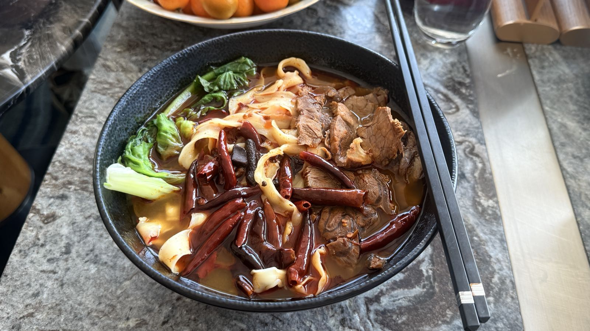

走在老家的大街小巷，记忆像是一颗泡腾片，在这个暖冬里挥发了。

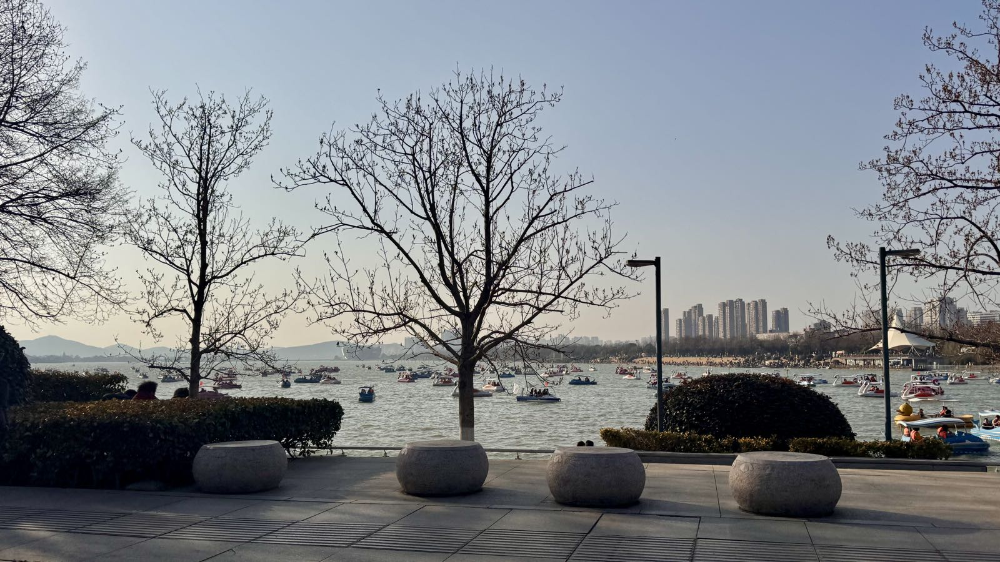

今年多了个环节就是被奶奶拉着语重心长的念叨，想让我们今年生小孩，“最好”还要是个男孩，最后递给我一个说是留了五十年的一张纸，上面犹如占卜算卦一样的写满了什么时间等条件下生男生女的概率大小。

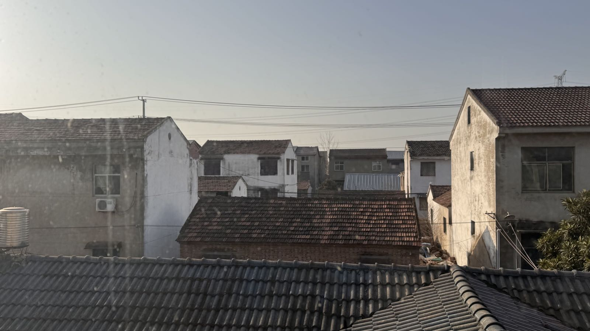

本来想抢的是初五21号回来的票，想着在家过满一周，但是始终抢不到21号的票，只能买初四20号晚上的，爸妈说那正好21号开车去送我们，顺便也和杭州爸妈见面聊聊，去趟新家看看装修，回来时候他们还能沿途旅游几天，爷奶也劝说让爸妈送我们过去，因为从地里挖的大白菜，还有村里买的黄豆之类的，说坐高铁的话不好带。

因为徐州到杭州车程要六百多公里，而且都知道高速堵车，出发前看导航显示要9、10个小时，另外我还不熟悉我爸的油车，更没有信心直接上高速，所以一开始听到爸妈要送我们过去我完全当作对我们不舍的一种表达。

但想了又想初四晚上如果一走了之抛下他们待在徐州并不能解决根本的情绪问题，而且到了杭州也确实能完成去新家，见杭州爸妈，返程时再走走停停旅个游。

这么一想，开车去杭州也不失为一种好的选择，于是当下要解决的问题就变成了尽快适应我爸的油车好给我爸分担一下，话说回来，其实回徐州的时候我正有开车回的计划，可以完成开车回徐州的成就，尽管不是自己的车，也合我心意。

初五回杭当天，九点出发，然而一上高速就感觉到了不对劲，而且每隔一段路就能看到有车发生事故，导航也不断提示前方拥堵。这一路就这么开着，走走停停，加上去服务区吃点东西休息休息，很快时间来到了下午。

发觉老爸开车时脖子酸了，拧了拧，锤了锤，我意识到该我上场了，于是在下个服务区停车，虽然没什么把握，为数不多的经验就是找车少的地方开了几圈，印象就是没有自己的电车好开。

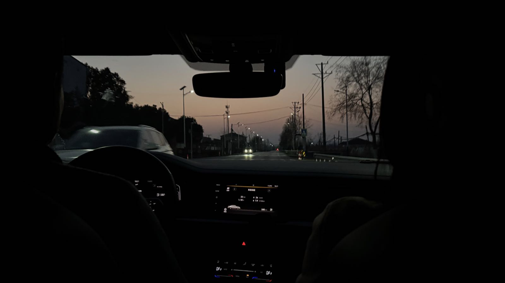

好在自己上手快，出了服务区变几个道就感觉上手了，看到爸妈一开始还在后面扶着座椅往前看，到后面就听到我爸的呼噜声了。

开着开着又到了傍晚，这时导航已经显示要晚上9点多才能到了，全程时长增加到了12小时多。天色渐渐暗下来，视线和徐州的记忆一起逐渐模糊。随着见到杭州路灯亮起，对杭州记忆又逐渐清晰起来，后面导航都可以关掉了。

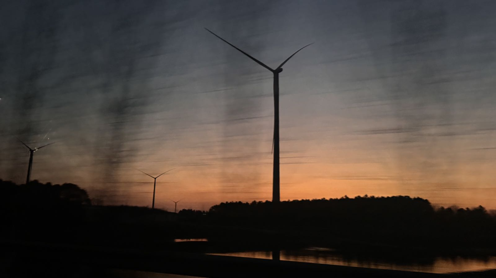

## 年后

到了杭州就开启了我年后的阶段，暨父母辈完成会晤计划，以及去了新家后，便带着我爸妈去开市客购物，买买路上的补给，顺便整了一顿美式午餐，下午带他们去我和老婆公司、以及钱塘江两岸看看，傍晚去泮芳春吃了顿小吃，晚上还恰好赶上7点半的城市阳台灯光秀。

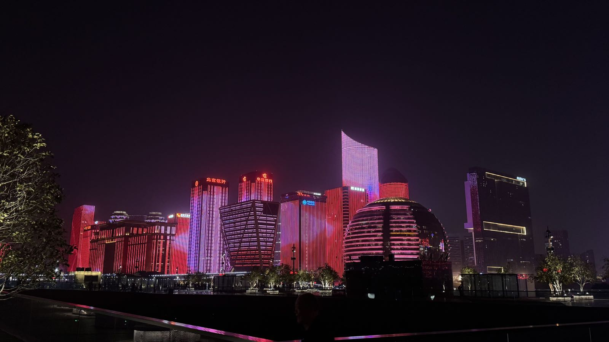

晚上爸妈说他们第二天一早就出发，打算去宣城，合肥，淮南一路北上，一路玩个几天最后回徐州。我和老婆也临时起意去了趟舟山，当天去当天回的来了一趟说走就走的旅行。

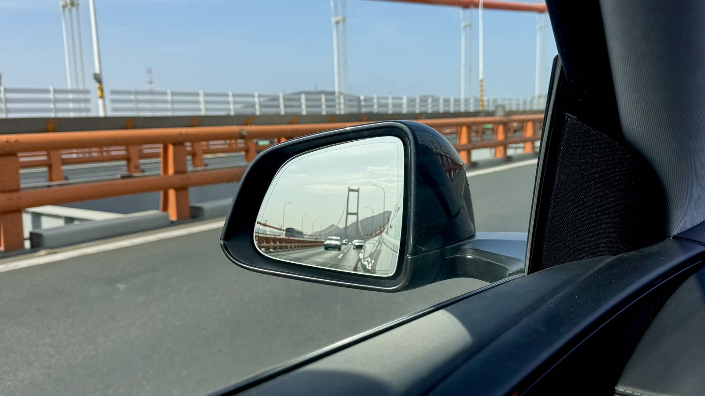

和自驾回杭州不同，这一路完全不堵车，畅通无阻，甚至有些路段一辆车都没有，想怎么开怎么开。下午去了马目山营地，晚上吃了舟山的海鲜面。

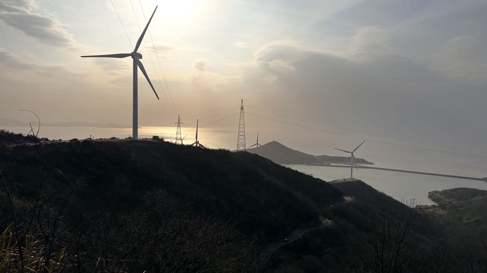 

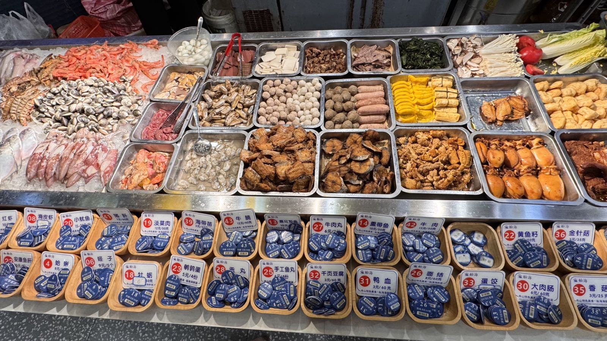

## 后记

我们走走停停，但时间不会。什么都会到来，什么都会过去。

百年长河也不过是你和我在经历着的一刻。

