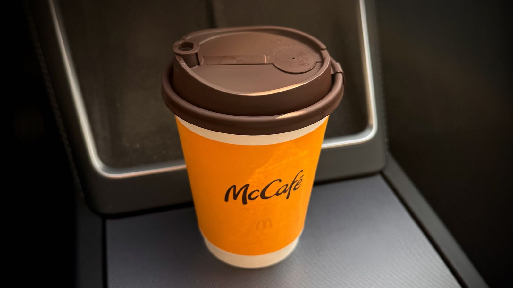

麦当劳品控｜翁家羿｜程前｜刘震云

<!--more-->
---

## ☕️ 麦当劳拿铁品控问题

点了无数次麦当劳的咖啡，自己爱喝燕麦奶铁，但最近愈发忍不住想吐槽吐槽麦当劳里拿铁的品控问题。

先叠个甲，自己去过杭州很多家麦当劳门店，我深知如果是一家店的问题那可能是个例。自己平时就爱好就是去打卡不同的门店，尤其是周末早上享受早上开车去一家没去过的门店的新鲜感，顺带着还能记一下各种路，这么做还有个好处可以让我像机器人建图一样在脑子里构建一个杭州立体地图。截止目前杭州滨江、萧山大多数门店都去过。

首先就是燕麦奶经常断货。麦当劳这么大的连锁店，居然还能有供应链的问题。经常出现很多门店燕麦奶都售罄的问题，想了想应该是控制成本导致？把每家店的存货都控到极限以此降低成本？

最大的问题其实是店员的水平，或者换句话说是管理问题。就奶泡而言，同一款热燕麦奶铁，每家店每天都能做的完全不一样。

有的店可以把奶泡打的很绵密，口感可以远好于瑞幸，不输代数学家和Manner。有的店员给他说奶泡帮忙打厚一点甚至不知道奶泡是何物。还有的店员回复一句我尽量，然后做出来一个满是气泡且稀薄的咖啡。甚至还遇到过有的店因为我这一句"蛮狠无理"的需求，几个大妈店员在背后大声议论我，一边递给我一杯不及格的作品，一边抱怨说燕麦奶就是不好打奶泡的。

网上不是说麦当劳的管理一贯的好吗？而作为顾客我只看到全是草台班子。PTSD到消息前都要犹豫一下，看下附近最近的一家是不是曾经踩坑过的店，还不能网上下单，因为APP没有备注的选项，要到当面强调自己想要一杯奶泡厚一点，绵密一点的，并展示一张正常奶泡照片，剩下的就只能祈祷他能做出来一杯及格的奶泡。

还是说根本原因是中信控股麦当劳的原因，准确说应该是金拱门而非麦当劳？金拱门为了扩张门店，像炸薯条、汉堡，可乐这种都是有一套有手就行的标准流程，而麦咖啡是需要一些门槛的，而这并非金拱门在意的业务。

想了又想，估计还是因为我不够富有，富有的话就不点麦当劳咖啡就不会有这个问题了。

## 🤔 翁家羿



这期播客是朋友推荐的，采访的嘉宾是OpenAI infra核心贡献者翁家羿，时长两个小时。

列一些节目中提到的几个印象深刻的话题：

1. 投资未来，想清楚你到底想要什么，然后你要投入更多的时间精力到更有意义的事情上面，例如学生时代的考试分数很重要，但是毕了业后两三年后没人关注你分数多少，所以你学生时代不用放100%的时间精力投资在毕业后完全没用的事情上面，而是要分担一部分出来投资在未来更有利的事情上。

2. **对于本硕学生来说，是读博还是选择工作？** [1:09:34](https://www.bilibili.com/video/BV1darmBcE4A/?share_source=copy_web&vd_source=91c61a69bc06d5baadcb355e4149105f&t=4174)他建议学生尽早进入工业界，还当着正在读Phd的博主何泰然的面说了一句暴论——**如果你的目标就是进入工业界，那么读PhD就是浪费生命。** 因为可能读了几年后新的范式已经来了，这几年间做的事情就没什么用了。其次就是你要搞清楚你到底想要什么，以及你目标的岗位需要的是什么类型的人，岗位需要的是你的项目经验，其实就是你能不能招进来帮他们解决问题。你完全可以用master为跳板，凑够读PhD进工业界的标准，例如你可以攒够引用数，然后做出一些能够让你与众不同的项目，让你可以跟同时期的PhD同台竞技，让岗位选择你而非另外那个PhD。**重要的就是想清楚差异化。**

3. 节目前面提到过"像是收到未来的自己发送的消息"，以及[1:53:44](https://www.bilibili.com/video/BV1darmBcE4A/?share_source=copy_web&vd_source=91c61a69bc06d5baadcb355e4149105f&t=6824)后开始论述宿命论。

4. 但也不得不提的是有些前后有些矛盾的论调，例如他一边信奉宿命，觉得一切都是上天安排好的，但又一边在说要投资未来的自己，让以后选择更多点。一边说不想活在既定的评价体系，一边又想要最大影响力，最多的署名权。这方面还是不如一些说什么都能自圆其说的老登。

最后说句题外话，这期节目听完我在X上就关注了博主[何泰然](https://x.com/intent/follow?original_referer=https%3A%2F%2Ftairanhe.com%2F&ref_src=twsrc%5Etfw%7Ctwcamp%5Ebuttonembed%7Ctwterm%5Efollow%7Ctwgr%5ETairanHe99&screen_name=TairanHe99)，现就读于卡内基梅隆大学的机器人博士生，他的主页[https://tairanhe.com/](https://tairanhe.com/)。

## 💵 程前朋友圈 - 2026年的机会在哪儿



1. 出海，不用直接ToC，而是直接ToB，To小B，让卖家他们能帮你搞定最后的销售环节。
2. AI工具。了解一大批人（市场）的痛点，比如喂给AI工具人脸+衣服，生成多组效果图，，省去拍摄成本，可以帮商家一年省去近百万摄影费用。借助Vibe Coding，每个月上架一个点子，一天能挣几千刀。还可以借AI写软件著作权，咸鱼卖4，5百，你卖6，7十块钱，天天爆单。
3. 介绍产品的自媒体。不是做内容->起号->赚广告费这条路，这是红海市场，要差异化才能突围。可以先有好的产品，再带点内容，让别人看着就想下单，例如特斯拉车标圣诞帽，日落灯...

## 🧑‍🌾 刘震云 - 咸(Sian)的玩笑(Siao)

