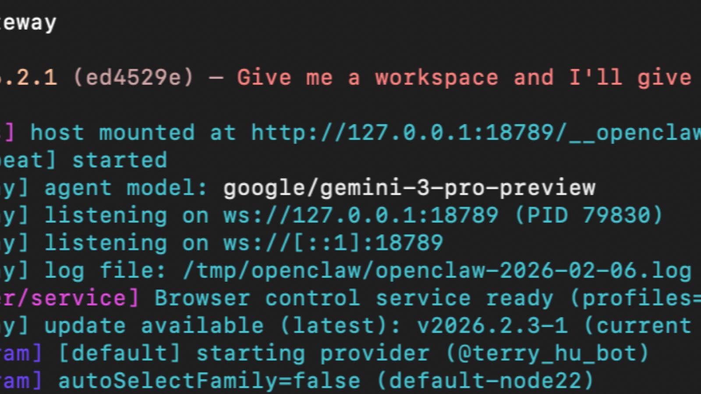
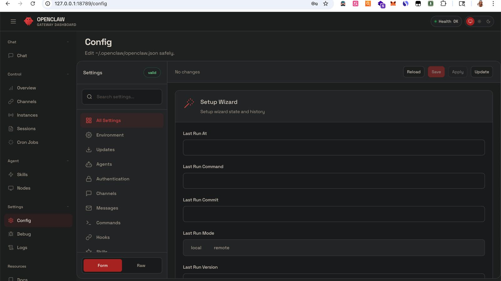
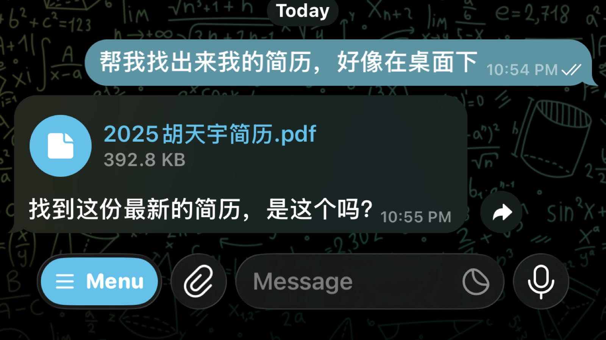
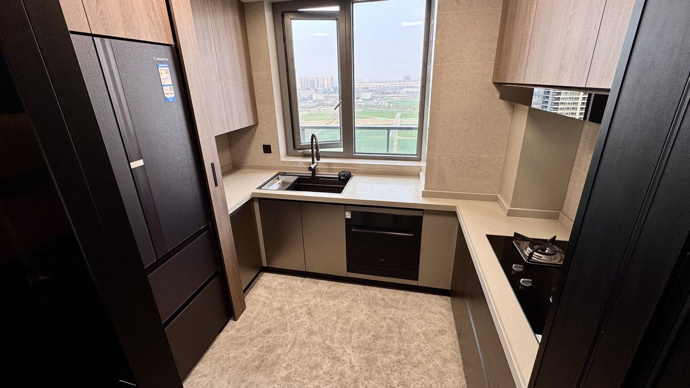

OpenClaw｜开荒保洁

<!--more-->
---

## 🦞 体验AI圈最近爆火的OpenClaw(ClawdBot)

当各个平台，各个博主都在发[ClawdBot](https://openclaw.ai/)，甚至讲机器学习的，讲Linux的博主都开始发的时候，这个事情就能感觉不对劲起来了，实在太火了，哪哪都有ClawdBot这个词，哪哪都有那只小龙虾的影子，这次不学都不行了。

mac上执行下面这行命令，之后根据提示一步步来：
```bash
curl -fsSL https://openclaw.ai/install.sh | bash
```

其中要配置大模型的api key，我这里选的是[gemini api key](https://aistudio.google.com/app/api-keys)，绑定visa卡后有免费额度，可以边薅羊毛边体验下。

之后终端里执行`openclaw gateway`启动程序



浏览器里访问对应的127.0.0.1:18789就能看到前端页面，点击左边栏里的`Chat`就能对话了



> [!WARNING]
> OpenClaw权限很大，推荐用云服务器/Docker/备用机
{text="注意"}

到这里其实对于用过cursor之类agent，尤其是claude code之类的cli，会感觉没什么两样。但是OpenClaw可以很轻松的接到Telegram等App，体验直接起飞。

### 🤖 接入Telegram Bot
搜索BotFather创建一个bot，从发送/newbot开始，最后拿到这个bot的token，填到OpenClaw的配置中。

其中要先保证环境中调tg api的网络是通的，可以用`curl -v https://api.telegram.org`自验下，如果不通的话，需要先解决网络问题。排查了下发现是没有走代理，执行下面两个命令让这个终端下的网络请求都走代理。
```
export https_proxy=http://127.0.0.1:<port>
export http_proxy=http://127.0.0.1:<port>
```

例如你可以通过在手机上发发消息，让它帮忙找找电脑上的文件



这时候AI完全充当了一个能控制你电脑的入口，而且这个入口还不是需要手动敲命令，而是一步到位的用自然语言就能描述，它帮忙执行。

体验了就能意识到AI Agent这个名字起的就很贴切，AI这次技术革命好像真的让这个世界不一样了。

## 🏠 新家开荒保洁

尽管有面玻璃有气泡的问题还没解决，已经和玻璃厂家掰扯了两个月，厂家许诺的周六前可以把玻璃换掉，然而最后还是一如即往的失了信。

考虑了下，原定于周六的开荒保洁决定正常进行，洗衣机、扫地机、冰箱、餐桌、沙发、床架也都纷纷进场。

话不多说，直接展示——





