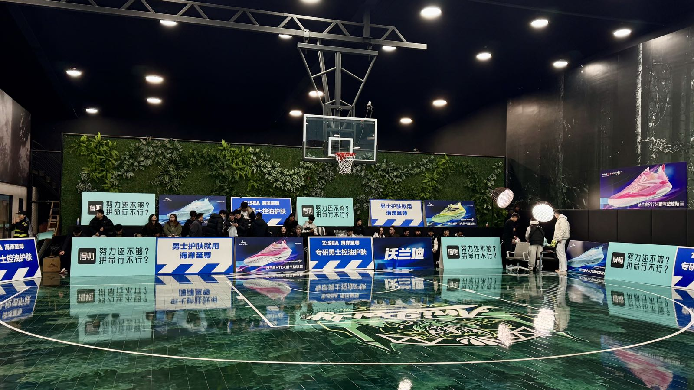

Manus｜刘靖康｜泰瑞｜威姆斯罗布

<!--more-->
---

## 🎧 Manus 季逸超



## 🎧 罗永浩 ✖️ 刘靖康



听完这期节目微博就关注了刘靖康，正如老罗所说，他的微博有一种"活人感"，不像其他创始人的账号全是产品宣发的内容。他的认知、谈吐和真诚的性格让我非常服帖，有种愿意甘心当他员工的感觉。

90后的他在大学时是个爱“显摆”的理工男，想要做一些不一样的证明自己，破解周鸿祎手机号、黑入学校考试系统，开发视频交友应用。之后在视频领域捕捉到全景相机的市场，创立insta360（影石），逐渐完成从理工男到创业者到企业家的转变。

## 🎧 HackBear泰瑞



HackBearTerry是我油管上专注很久的讲IT+工作+投资的博主，台湾人，旅居美国、日本。想不到他也录了一期长视频播客。

提到他小时候在成都生活过，上学时学习很一般，之后留学加拿大。整期节目听完有两点非常有感触，一是他说现在很多留学生其实家境其实没什么这么好，二是他毕业后同学都找到了工作就他自己没有找到，他投了海量的简历也鲜有人愿意给他面试机会，给了也面试不过，非常frustrated, 因为他并没有coding和项目能力。最后只有一个新创公司的老板给他机会。但他变得越来越强之后，"报复性"地把拒绝他的所有公司都面了一遍，发现找工作其实是双向选择（这一点深有感触，找工作其实和找对象一样）

## 威姆斯✖️罗布 百分大战

周六时候突然意识到周楷恒说的篮球春晚——威姆斯罗布百分大战，应该是在zooparty球馆打。23年4月份的时候就去过一次，这次有机会还能再去现场看，抖音搜了下果然，但是要门票499，想了想果断拿下。

比赛观赏性拉满，氛围也很嗨，喉咙都喊哑了，可惜罗布丢了罚球最后99:100，威姆斯惜胜 /doge
