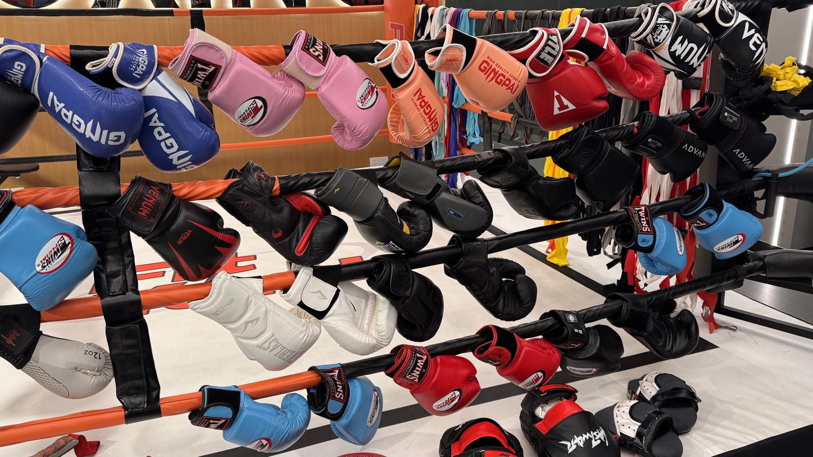
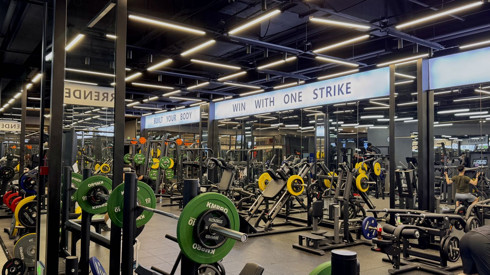
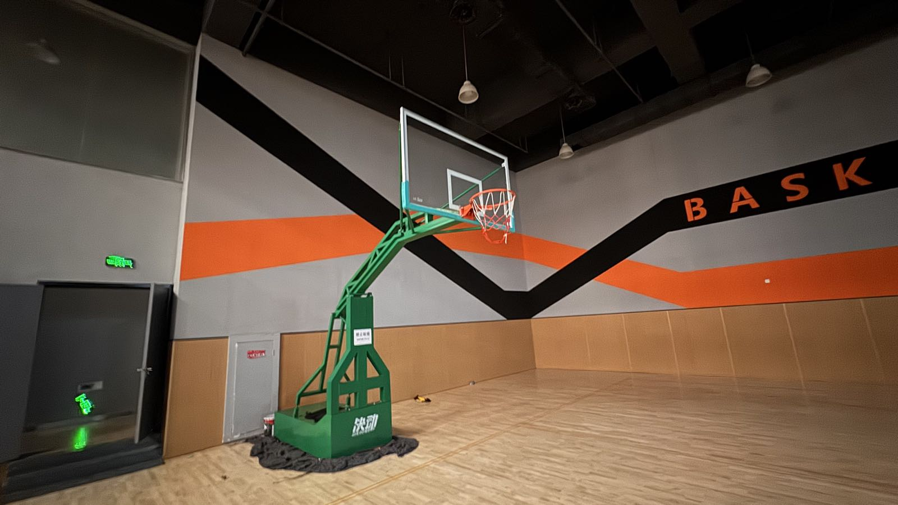
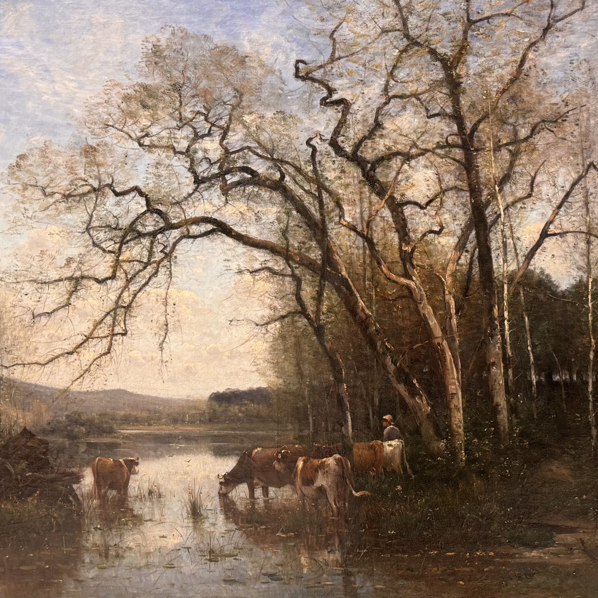
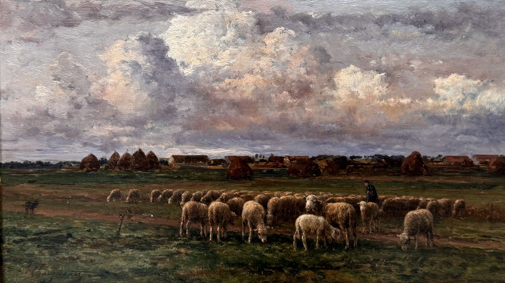
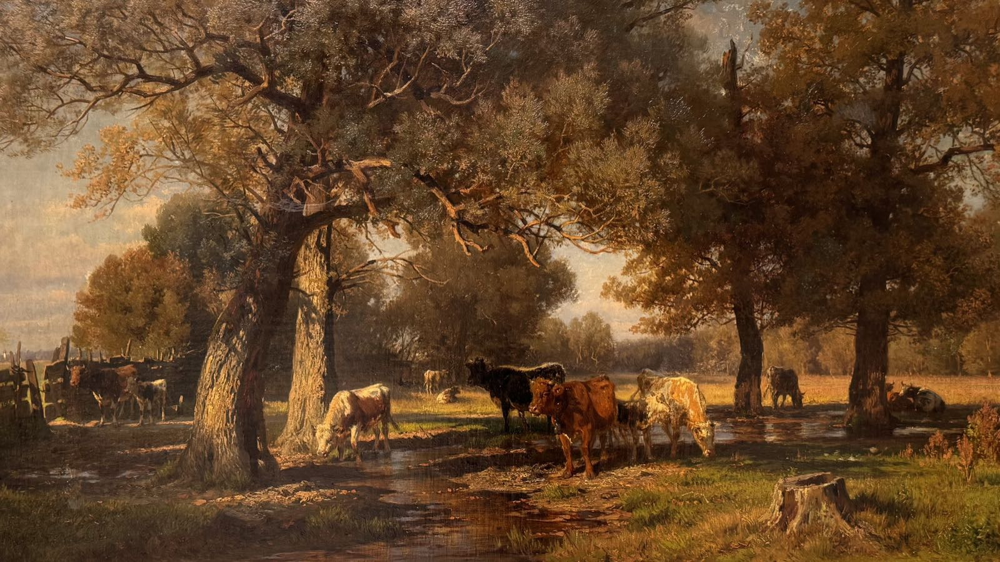

健身｜现实主义画展

<!--more-->
---

## ✊ 久违的健身

虽然不混健身圈，但是健身圈好像有句话挺有名，说是男人总是到了一定年纪就会自动走进健身房。

让我走进健身房的原因有很多，胡萝卜和大棒都有。一是最近胖了，此前体重一直非常稳定，每次称重都是固定数值，从来没变过，可这大半年一下胖了二十斤。二是每天工作久坐不健康，换工作以来已经大半年没打过篮球了，之前还每周五打打球，这么下去可不行。外加夏天快到了，谁不想拥有一个脱衣有肌肉的身材。

还有一个关键因素，是找到了一家公司附近的健身馆，里面是有篮球场的，这样一来又可以打得上球了。除此之外这家店也设备齐全占地面积又大，甚至有游泳池，甚至年费比周围其他家还便宜。

希望可以坚持下去，奥力给。

## 🖼️ 欧洲现实主义画展

全山石艺术中心近期有一个画展，「欧洲十九世纪现实主义绘画研究展——从康斯泰勃尔、库尔贝、巴比松画派到布丹」。

这些画家和流派我是闻所未闻，吸引我的一开始就单纯是这些有树木，有田野，有牛羊，以及寥寥人烟的风景画——

 

 

后面也是在场馆里的文字介绍，外加自己又AI搜了下才了解到，原来这些画作的背景是工业革命时期，整个社会发生了翻天覆地的剧变，以前有钱的是地主和贵族，现在有钱的是开工厂的老板。新的金主爸爸对古典神话人物并不感兴趣，他们更喜欢看风景画，甚至会让他们想起自己过去的乡间生活，同时这些风景画在满是臭水沟的城市化发展中显得尤为纯粹。

了解这层背景后再看，又多了一层感受。

