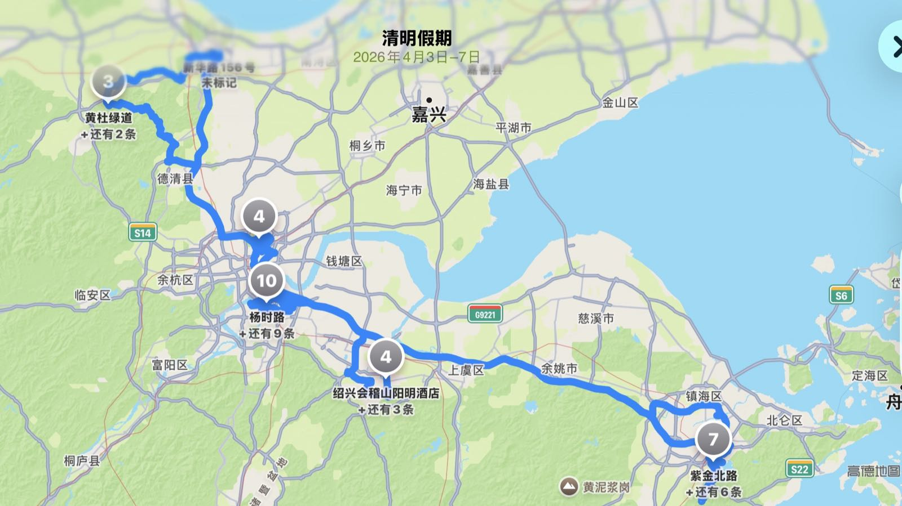
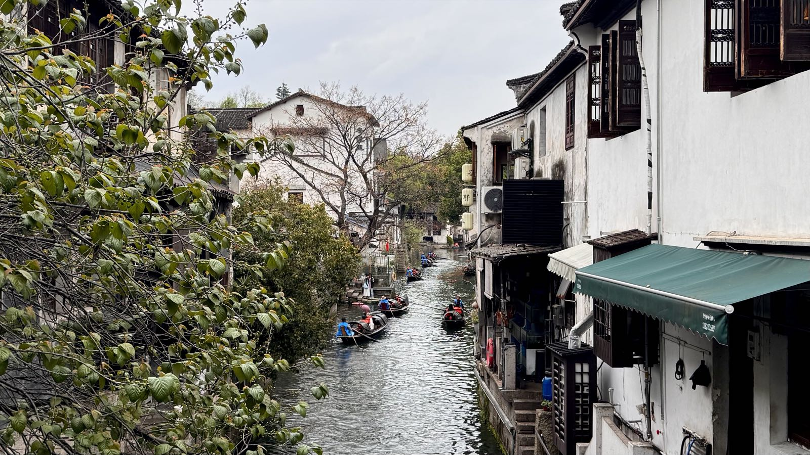
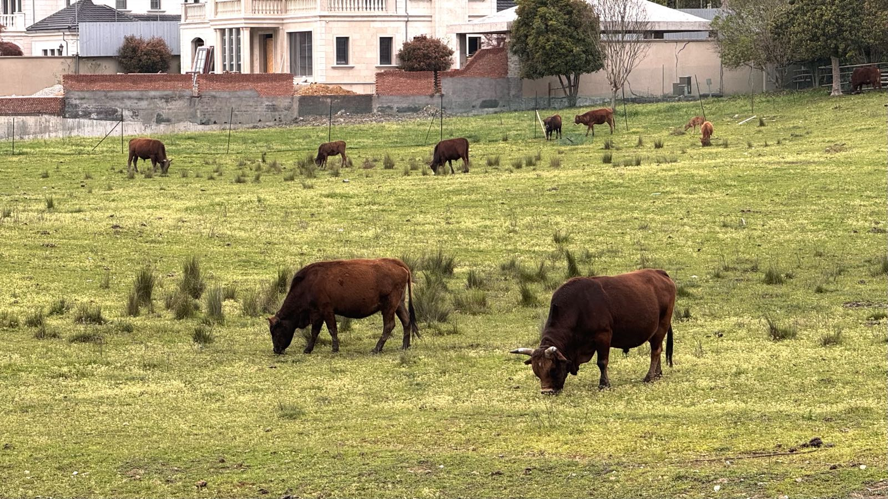
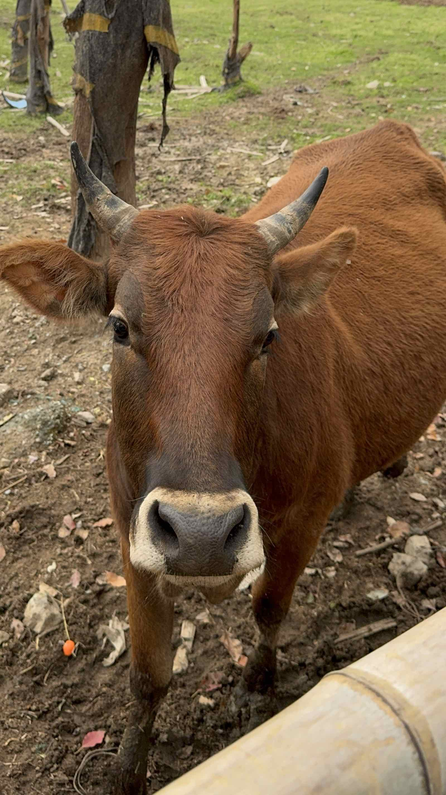
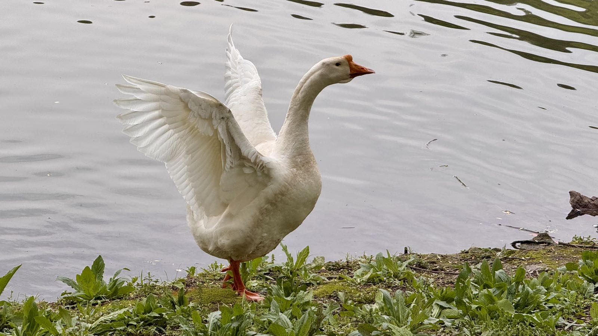
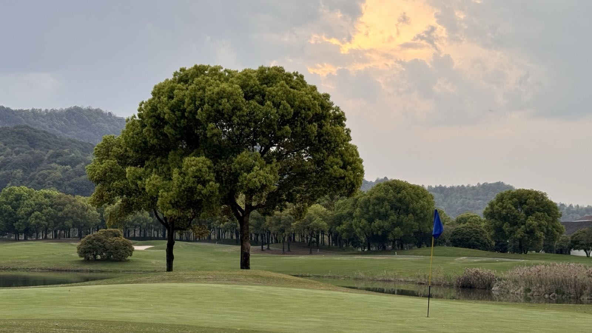
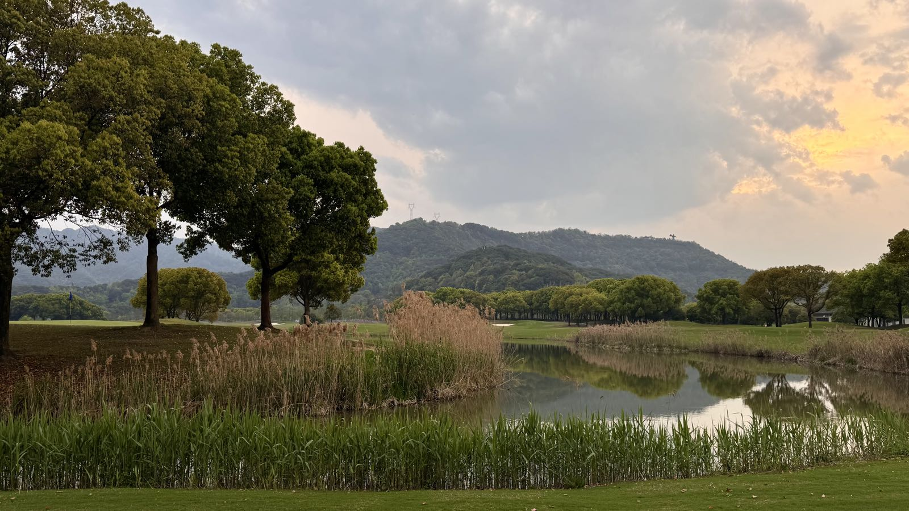
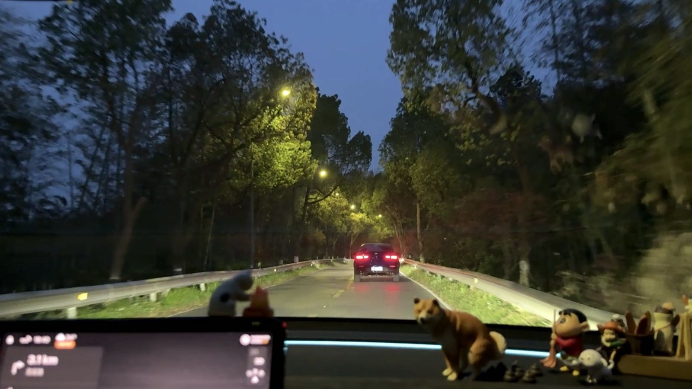

📍 清明｜绍兴｜宁波｜安吉

<!--more-->
---

清明三天假期，虽然中间一天的上午家里还安排了扫墓，但还是去了三个城市——绍兴、宁波和安吉。

可以说每天的行程都是临时起意，甚至都是当天出发前才决定的。而且三天都是中午出发，当晚就回来，每次一来一回就有几个小时，满打满算也就小半天，但奇怪的是每天都感觉很充实，仿佛一出门时间就变慢了一样，一小时可以玩出来两小时的体验。

## 🌿 第一天 绍兴

早上先去了充电、洗车，又去了轮胎换位，在这个过程中做好了今天的计划——

12:30杭州出发，到绍兴后在绍兴古城吃饭，逛逛下大路、西小路，15:30出发导航会稽山阳明酒店，17:00出发导航迪荡湖公园，18:30返程回杭。

下午直觉感觉迪荡湖公园可能没有会稽山阳明酒店那里有意思，临时改了计划，车上绕一圈迪荡湖就直接导航会稽山阳明酒店。

事实证明这个选择没错，这里有青山，有绿草，有牛，有鸭，有度假酒店，有高尔夫球场，还不要门票和停车费，占地面积大，人还少，十分推荐。

## 🍹 第二天 宁波

上午扫完墓，决定去宁波，一是可以支持摆摊卖柠檬奶的表姐，二是可以拜访宁波朋友的新家。

## 🏔️ 第三天 安吉

多年前去过一次安吉，但非自驾，去的也都是云上草原，自然博物馆这些景点。网上刷的帖子能感受到真正安吉的美要在山间，借用《游褒禅山记》里的话——
> 夫夷以近，则遊者众；险以远，则至者少；而世之奇伟瑰怪非常之观，常在于险远，而人之所罕至焉。

网上刷到的评论里有一句话也一针见血，说安吉没有好看的景点，只有好看的景。因为但凡能称上景点的地方，商业气息都会很浓。

反而是天色渐暗导航回家的时候，在还没进入大路前的半个小时，穿梭在山间、桥上、树林中的小路，是整个旅途最静谧、最治愈的蓝调时刻。

## 🌙 写于假期最后一晚的睡觉前

想起假期中有个瞬间，自己盯着看了一会天上的云在随风移动，突然意识到上一次这样发呆看云已经不知道过了多久，是三年五年还是十年，甚至有可能都要追溯到小时候的事。

那下一次呢？

另外放假出去玩，相比待在杭州，仿佛时间都会变慢。之前在新加坡的一年甚至都过出了三年的感觉，每一天都有新的体验，每一天都能单独拿出来展开、放大，而待在熟悉的地方日复一日的重复、循环，可能在麻痹中就虚度了光阴。

或许没有新意也就无从回忆。

