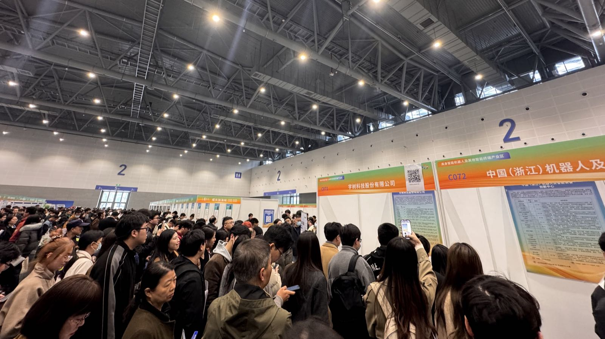
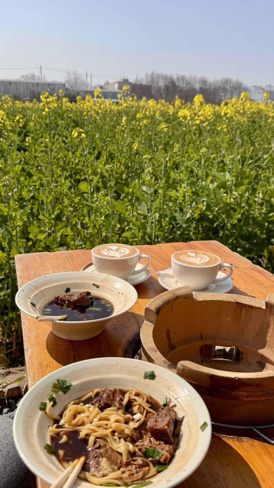

人才市场｜Vibe Coding｜油菜花｜义乌

<!--more-->
---

## 🏟️ 杭州起跑春天人才市场

周末陪老婆去了号称近年来杭州最大规模的杭州起跑春天人才市场 [[🔗]](https://www.hzrc.com/info/2026/2026spring/index.html)，举办于杭州大会展中心，上次来这还是看车展，没想到这次同样的场馆，摇身一变成了招聘的地方。

还剩下两个路口的时候就感受到巨大的人流量，远远的看过去求职的人就像蚂蚁搬家一样的，四面八方的人汇集到场馆门口。

走进场馆，每家公司都是一个小隔间，里面有蚂蚁、宇树这种排着长队的“摊位”，也有很多没听说过的公司，还看到不少公司开始招起来AI Agent开发工程师这一新兴岗位。馆里还有帮忙做职业规划、做社保公积金答疑的区域。走走停停的转了一圈，了解各个公司介绍、各个岗位以及薪资待遇。 

有意思的是有两家自己待过的公司，身为"过来人"再去看招聘描述，以及排着队等待投递简历的"曾经的自己"，心里有一番别样的感触。

几点感悟：

> 找工作其实和找对象没两样，面试就是相亲，上升了讲都是契约关系。面试和相亲一样，其实也都是双向选择的过程。如果你条件好，有更多价值，其实就是你在选择。

> 经常去这种人才市场看看，会体会到很多，也会反思平时怎么工作才能让自己更有竞争力。

> 都说机会是留给有准备的人的，有时准备是给有机会的人的。

## 🌾 机场旁油菜花边的一面

发现了一家宝藏面馆+咖啡店，位于萧山机场旁的村子里，不时能看到飞机起落。彼时正值油菜花的季节，在这里和吃上一碗满是牛肉的面，喝上一口咖啡，很是惬意。

## 🗺️ Vibe Coding An App About Map 

这些天染上Vibe Coding了。

正在开发一款主打地图可视化的ios app，界面和功能先不展开，先放一张初版的App icon，也是AI做的，nano banana 2出的图并没有预期的好，反而是grok和ChatGPT做的超出预期。

这段时间甚至开着车都要先把mac连上手机热点，出发前给他提一个功能，等红灯的时候看一下怎么样了，实现完了就看看效果再下发下一个问题。

发现开车和vibe coding真是绝配，现在开车变得不急不躁起来，看到绿灯倒计时的路口也不加速了，甚至开始期待下一个路口还是红灯。

## 🛒 世界义乌的小商品市场
周末去了趟义乌和一个老板谈了个大单，我这边一扫码对方支付宝到账六百多块钱还不给抹零的那种。

起因是老婆想买泡泡玛特断了货的比奇堡丑鱼，只能去义乌买祖国版，也借此契机来一次杭州边游。

Jellycat, 泡泡玛特之类的小玩意都在义乌国际商贸城一区东扩4楼，这里像个黑市，什么款式都能给你整出来，同一款产品分有标没标的，有jellycat标的就要贵点，没jellycat标的便宜点，当然做工要更差一点。而且同一款有标的产品，不同家里的在细节上做工还不一样，能明显看出来是两个源头的货。

比这个黑市更黑的是晚上的夜市。里面直接演都不演了，小商品城里卖五十九四十九的，这里只卖39，甚至不带标的直接十块钱任选，各大品牌香水全都50一瓶，袜子10块钱一打，甚至还有数码产品。

不时能碰到不知道是中东人，大众点评一打开发现很多中东菜，甚至饭店老板都是中东的。再想到小商品城里也用英文在tiktok出海带货的，世界义乌，实至名归。