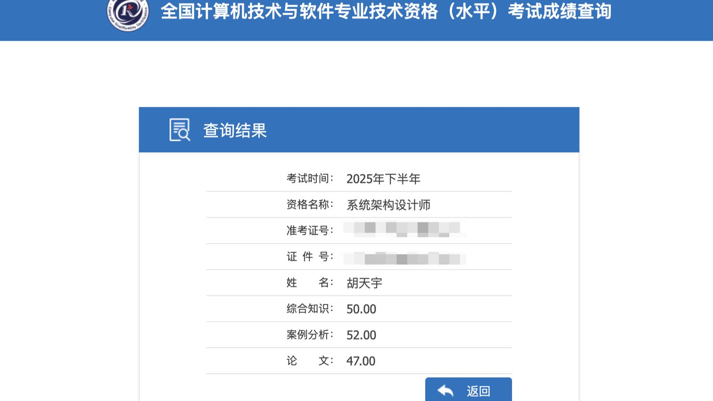

拿下软考｜朋友聚会

<!--more-->
---

## 一不小心拿下软考

在这个平静的周五下午，五点多快要下班的时候，看到之前加的软考交流群里消息好多，点进去原来是出了成绩。我一边想着一个月的考试考完都不想查分了，一边又好奇这次各项分数是多少，就怀着这么个心情，登录网站发现自己一不小心就给软考拿下了。各项在45分以上就算通过。

想到自己甚至考试前一天晚上还和老婆说要不自己这次就只考选择题，案例题和论文自己完全没准备，在那里坐着也是煎熬。在那周的博客[十一月第一周 - 软考结束](../nov-2-9/)也写到又一次考完了没怎么准备的软考。

案例已经来不及准备，但是考前的一晚还是突击了一下论文，在trae里喂了gpt历年论文范文以及模板，再加上自己的项目经验，让他生成一篇可以应付所有课题的论文，并让他分成多个段落的标题，这样有助于背下来全文。回头过来想想那晚这个准备毋庸置疑是能47分飘过的关键因素。

有句话叫"行百里者半九十"。大学时候考雅思的时候我也一度想要放弃，和这次软考一样，觉得自己准备时间太短，完全没有准备好根本不可能过。感谢当时咬牙坚持去考的自己，让我没有行至九十的时候放弃。

## 和朋友小聚

老婆朋友约我们一起去她家煮火锅，玩大宋百商图的扩展包。说到这就不得不提极其巧的是，她老公的房子就在我们隔壁小区。下午先去吴山广场吃吃喝喝，那边游客和车子都很多，停车比较麻烦，好在哥们已经也是个开一万多公里的人了，这种场景还是应对的来的。

晚上在朋友家边吃边聊，分享近况，感觉每次和朋友小聚都有种意义感，因为一般都是时隔几个月聚一次，大家生活上都在发生各种各样的变化，比如近期xx在准备结婚，xx换了一份工作，xx最近在忙于装修，像是见证着彼此之间各个阶段的变化，虽不是朝夕相伴，但却从未缺席。

吃完火锅，大家准备打打桌游。我从小就对扑克、麻将提不起兴趣，小时候在家过年亲戚朋友打牌，我都是自己忙自己的， 也学过打牌，但真是玩不进去。另外自己对于什么宋朝明朝那种历史文化完全不感兴趣。但人数不多，这次大宋百商图的桌游如果自己不玩扫了大家的兴致。而且再枯燥的事情和几个朋友一起也有乐趣，过程中一些插曲直接给老婆眼泪都给笑出来了，看着一滴泪顺着脸庞流到下巴，自己也确实很久没这么开怀大笑过了，成年人大家应该都是如此吧。

玩着玩着就到了后半夜，好在是周六晚上，明天也不用上班。

