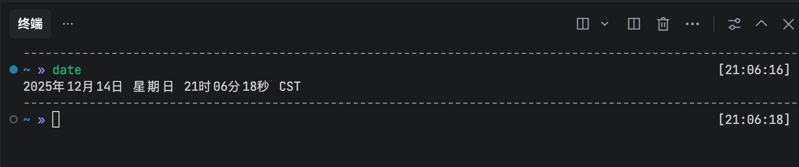

特斯拉码表｜MiniMax闫俊杰｜Tabby

<!--more-->
---

## 🚙 咱特斯拉自己的nomi———TITA饼

趁着双十二终于下单了TITA饼➕坤坤假发，这俩在我购物车待了半年，一开始怕冲动消费，毕竟TITA这一套下来要七百，蔡徐坤头发更是离谱，小一百块钱。但是半年中发现自己每每看到还是会乐一下，平时自己开车逛时也总觉得无聊，有了这个搭子能多点乐趣，拿下。

## 🎧 罗永浩✖️MiniMax创始人闫俊杰

有一说一听完的总体感觉并没预期好，印象在往期节目里倒数第二，倒数第一是谁就不说了，那一期我甚至没加在每周博客里。

印象最深的点是闫俊杰出身于河南偏远的小县城，89年出生，和我表哥同岁。我是出生于江苏徐州县城，离河南并不远，加上我小时候一直和我表哥玩，所以脑海中有一个大概的印象，想必应该差不太多。

## 💻 Tabby终端工具 

工作里的终端之前一直用的是公司jumpserver搭的跳板机，以及mobaxterm。但是久而久之就想追求更炫酷、更好用、更趁手的工具，不然总有一种小米加步枪的感觉。

简单检索了一下就在几款工具中选到了tabby。UI做的比mobaxterm年轻多了，有种系统从windows xp换macos的感觉。自己每次安装一款新app都喜欢摸索一遍设置，一方面能根据设置熟悉一下有哪些功能，另一方面也能通过设置调整自己的偏好。

安装完毕后就装了zsh和oh-my-zsh，选了af-magic主题。这个主题有完整当前路径的展示，每行命令结果之间都有分隔符，另外最后还有执行时间。

