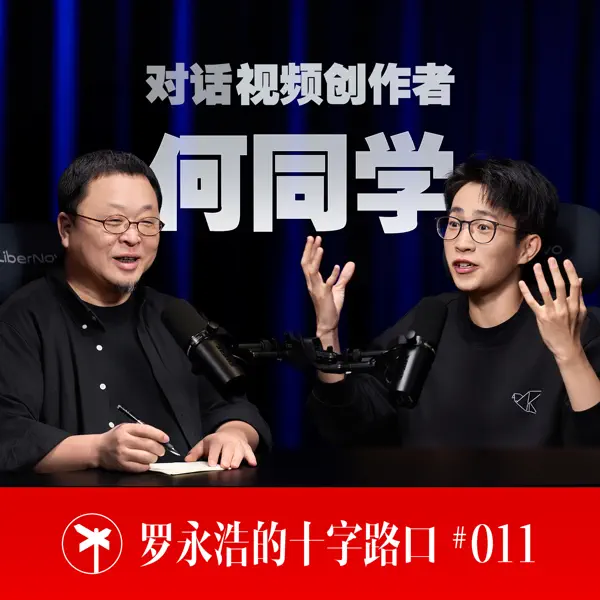
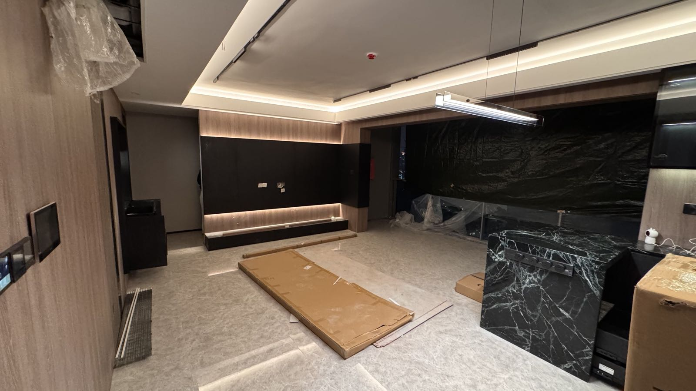
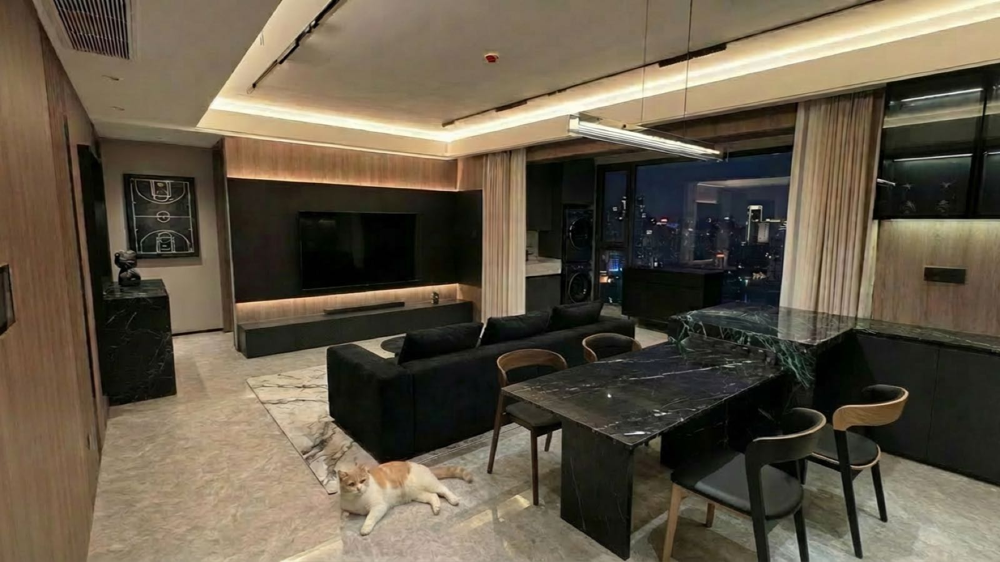

何同学｜贪心｜复盘｜Nano Banana

<!--more-->
---

## 🎧 罗永浩✖️何同学

这期的"盲盒"抽到的是何同学，和往期嘉宾一样，无一例外又是一个谈吐之间尽显真诚的嘉宾。

搜了下何同学99年出生，比我小一岁，其实在自媒体时代太多00后的网红博主，九几年甚至都是老一辈了。也的确，自己也是奔三的人了。

这一期听下来能明显感受到何同学相比较而言"学生"气质很重，看多了前面都是何小鹏、李想、叶国富这种大企业家，这一期听下来并没有给到太多反差感，例如何同学也在布局一个商业帝国等等，多的是听到何同学真的很接近一个印象中在中国教育体系下培养出来的经典的学生————小时候好好读书，长大考个好大学，报考理工科专业，性格阳光开朗，爱好和梦想都是做视频。视频的主题多是一些受众是中学生的"玩具"，例如扔垃圾自动开盖的垃圾桶...用何同学的话说就是想象过自己如果视频没火起来进入影视行业，自己应该是在大厂当程序员或产品经理。一切听下来都是那么像一个"普通"的大学生，他有很强的DIY能力但是无心商业化，尽管有很多产品找过来联名、谈合作，自己想的仍是怎么借这笔资金继续投入到做视频中...

何同学最大的价值就是帮着国家宣传了5G，且外貌气质以及爱好都是一位国家教育体系之下教育来出的优秀好学生的典范。

## 🔺 贪心

LeetCode里有一类题目是"贪心算法"，每次需要做选择时都出局部最优的选择，从而最终就能获得全局最优的结果。最近装修需要添置各种东西，，突然发现可以用上这个"贪心"思维，最终下决定前有没有觉得这个东西物超所值，若是没有一种"物超所值"的感觉，那么很可能就是"不值"的。

这种"贪心"的思维其实是在回答一个问题——如何知道自己不知道的事？所有事都可以按照四个象限划分，知道自己知道，知道自己不知道，不知道自己知道，不知道自己不知道。前面三个其实都还好说，关键是"不知道自己不知道"的事，其实就可以发散的想想有哪些事情自己从未听过，看过，想过，例如如果没人夸过你高，那么大概率你比较矮，如果你从没觉得xx好，那么它就是不好...

## 📝 复盘

最近开会时领导带着我们简单复盘了一下我们的工作进度，但我是第一次感受到复盘的价值。之前总是听过复盘好，但自己其实很少尝试过，尝试过也还是没有坚持下来。自己做这个网站按周为记录其实有一点就是逼着自己复盘一周的事情。

复盘了，才能进步，像是做错了题目，如果不回过头对着答案和解析再想一遍，下次再做还是会做错。

## 🎨 Nano Banana Pro

这周的AI无疑是属于google的，先是gemini-3-pro，又是nano banana pro，都是王炸般的存在。

lovart.ai/上体验了nano banana pro——

输入一张正在装修的照片，让他帮我设计设计，带我想要黑色沙发、家里小猫之类的需求
输出的设计图效果真的不错：

