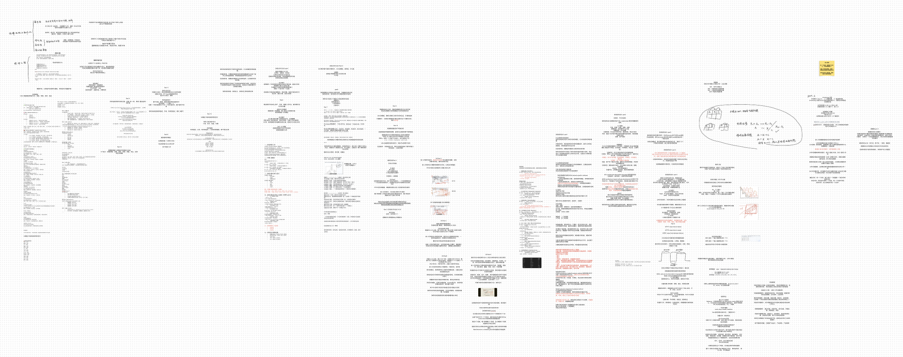
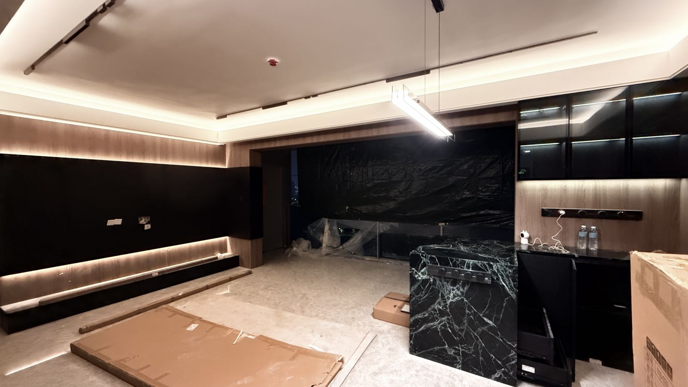

老爸生日｜准备软考｜装修｜贾樟柯

<!--more-->
---

## 老爸生日送了他一条皮带

上周收到老妈微信，说生日可以给我爸买一条皮带，我问平时都带什么价位的，老妈说四年前我刚工作第一个月买的金利来的还在一直带着。四年前的事我都忘了，翻了下购物APP和微信聊天记录看到确有其事。

问了下chatgpt给我爸买什么牌子的皮带不会出错，结果gpt答了一堆国外的品牌与型号，搜了两个发现国内都没有。最近愈发感觉这类日常问题还是国内deepseek或豆包+联网搜索好用，更适合国人体质。

挑了挑看中了一款Coach的，算不上奢侈品。好久没送爸妈东西了，这个还是送的起的。下午给回了爷奶家的爸妈打视频时说了，但我妈嫌贵，说金利来的就好，自己家人没必要买奢侈品。但看的出来她也觉得好看，唯一就是觉得贵，遂后果断拿下，京东显示第二天就能让我爸拿到。

第二天收到我妈群里发的消息，说我爸拿到就带着去外面显摆去了。

## 周末准备软考

周末在家刷完了up秋意浓啊浓的[软考高级系统架构设计师全部选择题真题详细讲解](https://www.bilibili.com/video/BV1q8gKzpE7w/?share_source=copy_web&vd_source=91c61a69bc06d5baadcb355e4149105f)

下周就要开考了，案例和论文还没准备

## 装修过大半

这周日一早闲鱼120找了师傅来装锁，新家装修终于搞完了七七八八。待之后收尾完必须好好写一篇装修记录。

## 罗永浩✖️贾樟柯

有一说一，这一期没听进去，对于贾樟柯导演不了解，只是名字有所耳闻，搜了一下好像也是一部作品都没看过，但听完下来感觉贾导也是一位真诚的人。