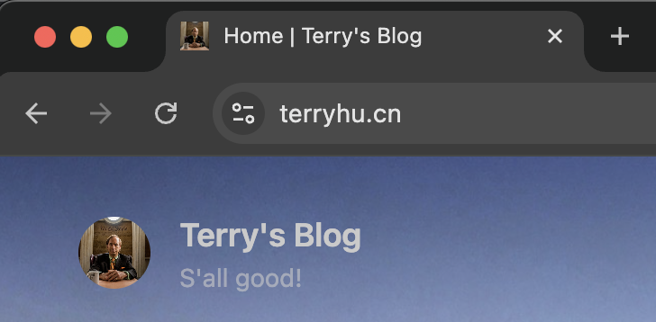

Py远程调试 | 罗永浩Tim | 喜提域名

<!--more-->

## 💻 Pycharm本地断点调试远程启动的项目

目的在于记录和梳理整个探索的流程，细节方面如有需要的可以联系我

0. 下载pycharm并激活

1. 利用pycharm中的deployment功能保证本地与远程文件同步

2. 使用远程服务器上的py解释器
这一步非必需，但如果本地环境没有安装依赖的话，很多库会报红，函数无法跳转。如果代码运行在远程Docker容器中，则需要确保容器可以ssh，步骤如下：
```bash
yum install install openssh-server
ssh-keygen -t rsa -f /etc/ssh/ssh_host_rsa_key && ssh-keygen -t ecdsa -f /etc/ssh/ssh_host_ecdsa_key && ssh-keygen -t ed25519 -f /etc/ssh/ssh_host_ed25519_key
vim /etc/ssh/sshd_config（Port改一下，PermitRootLoging改成yes）
yum install passwd
passwd
/usr/sbin/sshd -D &
```

3. 远程环境中安装pydevd-pycharm
`pip install pydevd-pycharm`即可，如果因为网络问题无法安装，也可以在[pydevd-pycharm·PyPI](https://pypi.org/project/pydevd-pycharm/251.26094.141/#files)里下载tar.gz，用tar -zxvf解压，python setup.py install离线安装

4. 项目远程断点调试
在项目代码入口加代码，ip填本地的，port随便填不冲突的
```python
import pydevd_pycharm
pydevd_pycharm.settrace('x.x.x.x', port=1234, stdoutToServer=True, stderrToServer=True)
```
启动本地python debug server，会提示你Waiting for process connection...这时再启动远程项目，如果看到本地在项目开头被断点捕获，则大功告成。最后如果代码中有多进程可能断点捕获不到，可以debug时修改成单进程。

## 🎧 罗永浩对话影视飓风Tim


又是一期酣畅淋漓的三小时播客。不过话说回来，记得老罗在西贝事件的时候说播客会停更一周，下一周会连出两期。前些天坐飞机回来的时候还突然意识到节目应该更新了，后悔缓存下来正好路上听，不然只能无所事事。但结果下了飞机看居然还没更新，而且也没连更两期。

回想一下节目中有意思的几点：
1. Tim居然是杭州人
2. Tim居然说自己是I人，但是又是体验电击枪，又是潜水拍抹香鲸，又是荒岛求生直播，还要去蛇岛，这多少沾点表演型人格吧...
3. Tim真是一个纯粹之人，拒绝融资，不买豪车，衣着朴素
4. Tim在布局一个帝国，衣服，综艺，影视，短剧，人文科普...

## 🌐 喜提域名terryhu.cn


促使我从github.io换到独立域名的，是想加入BlogFinder这个博客发现平台。

向BlogFinder申请提交了很多次，但都石投大海，加到创建BlogFinder的老哥微信私信后才了解到需要独立域名这个门槛（其中一个原因是可以用域名是否过期判断博客是否还在更新）。

遂后当天就去阿里云搜索了terryhu这个域名，在.top和.com.cn等后缀中选到.cn，修改了项目部署方式，当然过程中也踩了几个坑，例如换完发现图片加载的变慢，之后又去大善人cloudfare那里要了点饭，换了dns解析的地址，又在trae里让ai帮我分析并修复图片加载慢的原因，一套组合拳打下来后，网站加载速度终于好了很多。

最终也是私信到BlogFinder老哥，顺利通过。

