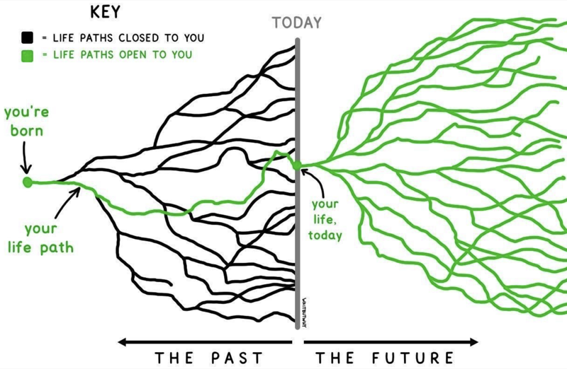

<!--more-->

## 我的答案
其实自己很多年前就整过个人博客，换过很多框架，jekyll，hexo之类的，主题也是一换再换，但结果就是都没坚持下去。

回想了一下，一开始搞个人博客主要是工作中会不时看到别人的博客，看到别人有的东西自己也想有，于是乎三分钟热度也整了一个，但是整完写了几篇下来新鲜劲就过了，因为更新博客是一件很痛苦的事情，首要的就是需要你一段完整的时间，要开电脑，写作，中间还要搜集图片，最后提交到git仓库还时不时可能因为网络环境提交不上去，而且很多时候都不知道该写什么内容，有的内容写完甚至感觉没什么意义，因为自己的博客就是一座孤岛，无人关心无人在意，所以个人博客网站的意义是什么？

这个经历可能很多人有同感，而是其中一部分人肯定就放弃了，我也是，一放弃就是好几年。但是最近一段时间，INFP的我总在思考另一个问题————我到底想成为什么样的人？

这个问题乍一听挺深刻的，但是也挺老生常谈的，因为我相信每个人多多少少都有问过自己这种问题，因为这个问题的影响实在太大了，因为你如果回答不了这个问题，很多事情做起来是会很拧巴的，你自己都不知道在追求什么，那只能被情绪牵着走，做一个永远趋利避害，普普通通的人。但如果你明确的回答了这个问题，可能是更可怕的，因为人的阅历是有限的，以当前的阅历回答了这个终极问题，可能会让你错过了一个更加美好的未来，这完全上升到了一个哲学问题。

但我还是以我目前的阅历，冒险做出了一个回答，这个回答也就顺便解释了我做个人博客网站的意义，至于我的回答是什么，这里就不展开了，但是未来都会体验在我的网站里，换句话说，我的网站方方面面都在解释我对于这个问题的答案。