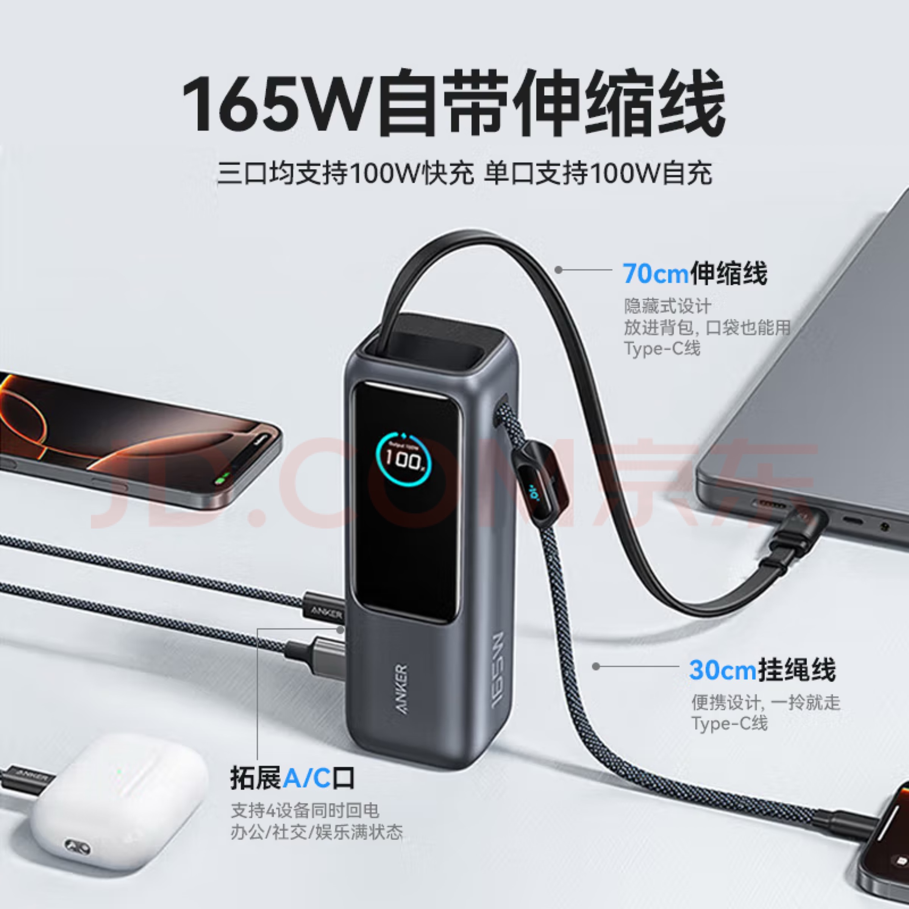

节前工位主理人 | 购入Anker A1695

<!--more-->
---

👆国庆节前的工作状态

## 购入Anker A1695

为解决即将到来的全家新加坡之行的续航问题，且现在中国机场严格限制了充电宝要有3C认证，原来家里的充电宝没3C认证且容量小，不足以全家6个人的续航需求，现需要重新购买充电宝。同时也能给自己长期使用，作为一项小小的投资。

挑来挑去还是选择了Anker A1695，因为我和老婆父母全是华为手机，和我和老婆的手机一样都是C口，这款充电宝自带两根typeC的线，而且最高支持同时给4个手机充电，额定容量1万5mAh可以从0到100充满4部手机，完全满足需求。

一个充电宝背在身上让全家六个人没有续航焦虑，安全感直接拉满。

