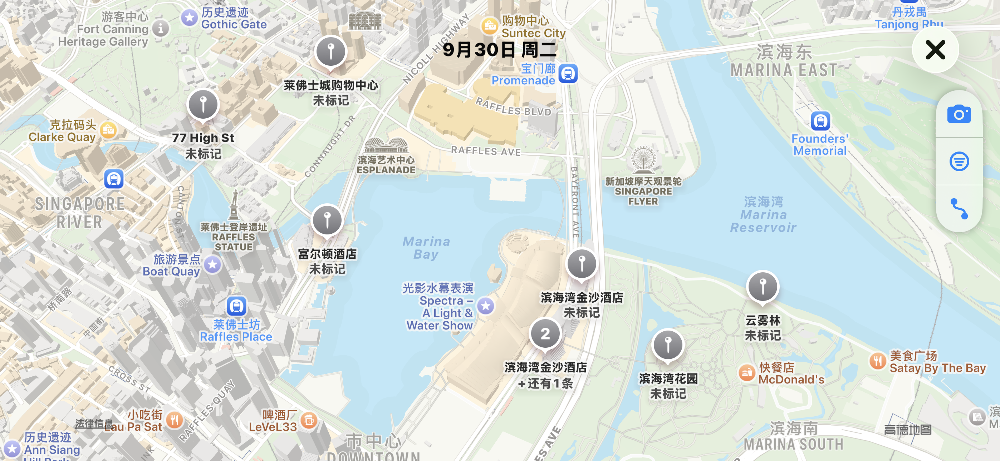
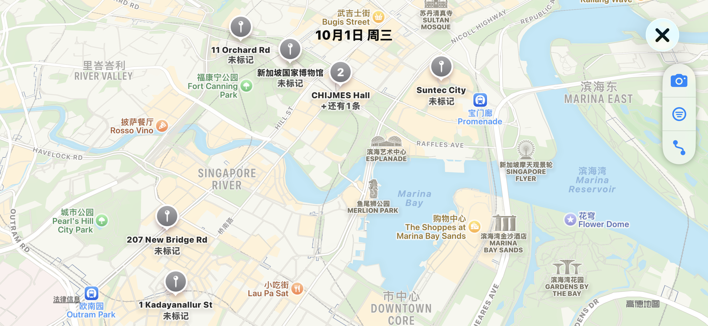
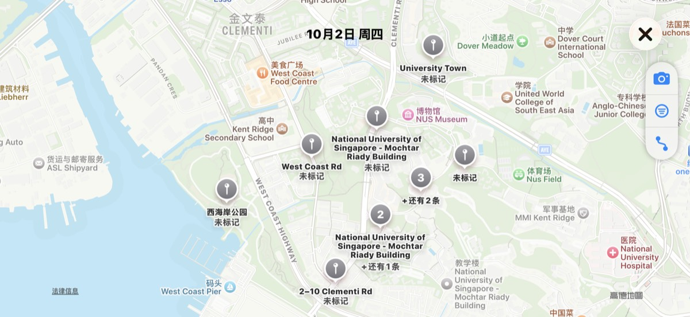
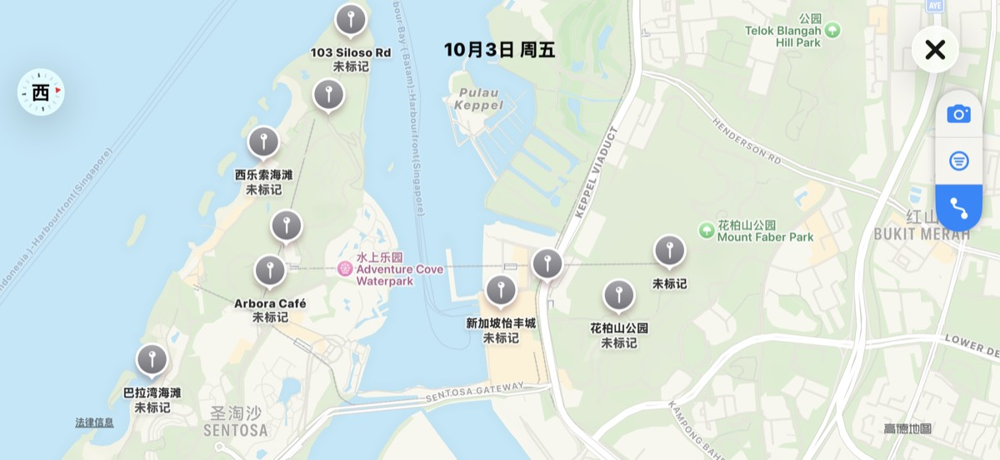
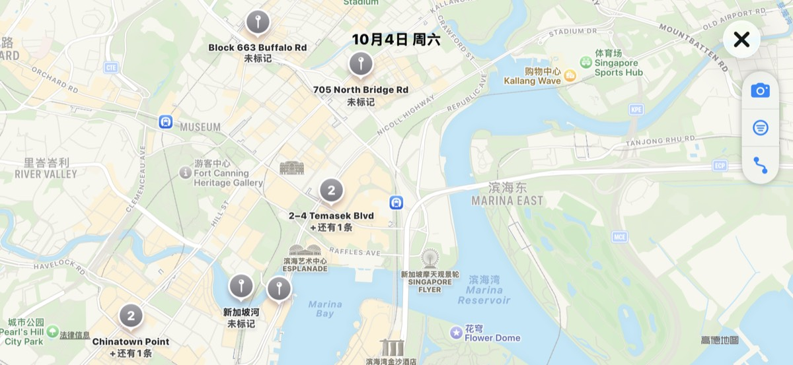
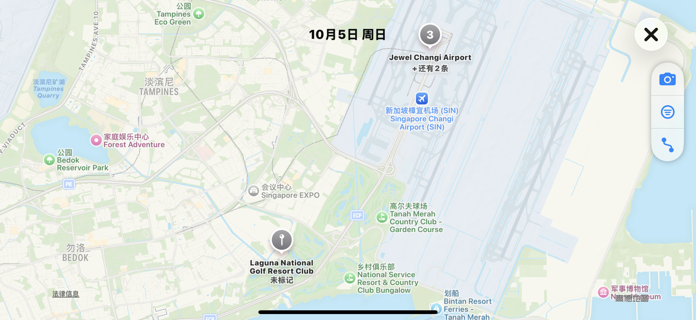
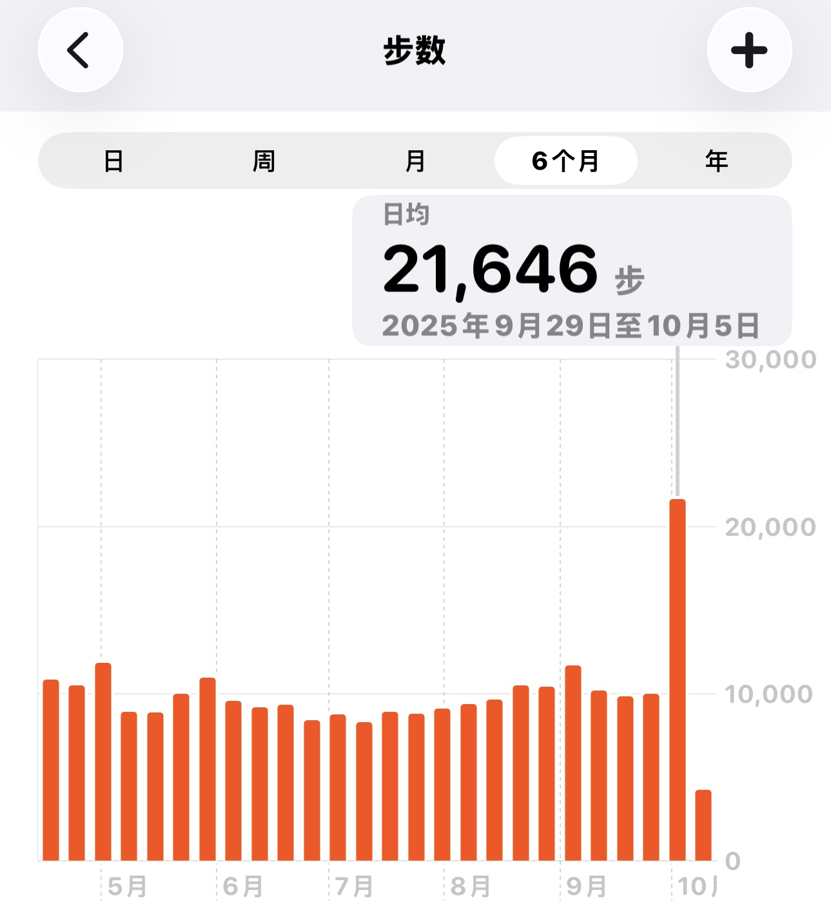

🇸🇬出现又离开的六日旅途

<!--more-->

## 六向奔赴
前段时间除了忙于买机票、酒店及门票，因这段时间正值新房装修阶段，爸妈从老家赶来，想给他们看到一个尽可能的落地效果，因为小区周末及假期怕扰民不让施工，所以在国庆前能施工的天数寥寥无几，目前全屋柜子已经装完大部分，石材方面我们选的普拉达绿作为岛台和餐边柜上的点缀，去店里和老板谈了半天说是加急的话刚好能赶上。全屋智能也可以工作日先用冲击钻打孔，国庆时再做一些不扰民的安装。

节前我和老婆都请了一天半的调休，我爸妈中午坐高铁来杭州，上午下了班我和老婆就去火车站接我爸妈，我岳父岳母在家里准备饭菜，吃完饭就去赶晚上9点的飞机，当天凌晨2点就能到新加坡。现在想想看六个人的行程还是不容易的，如果说两个人之间的奔赴叫双向奔赴，那我们六个人就是在“六向奔赴”。

## 六日旅途
### Day 1 - City Walk于Marina Bay

### Day 2 - 了解新加坡历史后再看新加坡

### Day 3 - 重返母校NUS

### Day 4 - 登岛圣淘沙

### Day 5 - 自由行看F1

### Day 6 - 樟宜机场

## 出现又离开
虽然这些天每天都是早出晚归，用十二双脚丈量着新加坡，日均两万多步。

但时间还是过的飞快，和四年前在NUS毕业回国时一样，如果说四年前像是和我老婆一起做了一场梦，那这一次就像是带着爸妈一起重返了那场未做完的梦。

在最后一天登上回国的飞机后，我的脑海里就一直循环播放梁博的那首《出现又离开》，也没有别的歌更能恰如其分的表达我彼时的心情了。

出现又离开的不只是作为游客的我们，还有很多。